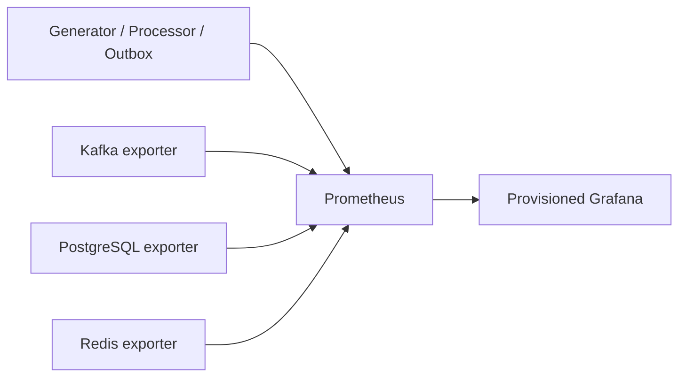

# Real-Time Commerce Platform

A lightweight, event-driven commerce platform intended to demonstrate
realistic customer journeys and reliable event processing on a local Apple
Silicon development machine.

## Current status

Sprints 0 through 9 are completed. Sprint 10 is current and adds an interactive
local Demo Control Center with fixed scenarios, managed runs, SSE progress,
run-specific PostgreSQL outcomes, platform health, and Grafana navigation.

Sprint 3 shared event contracts and canonical serialization are completed and
remain the generator's only schema source.

The envelope, payloads, registry, versioning policy, and partition-key guidance
are documented in [Event contracts](docs/event-contracts.md).
Generator operation and boundaries are documented in
[Event generator](docs/event-generator.md).
Persona and anomaly semantics are documented in
[Stateful personas and controlled anomalies](docs/personas-and-anomalies.md).
Processor behavior and failure semantics are documented in
[Kafka event processor](docs/event-processor.md).
The schema, migrations, transaction boundary, and recovery behavior are
documented in [PostgreSQL persistence](docs/postgresql-persistence.md).
The rule registry, scoring, persistence, and crash windows are documented in
[Rule-based fraud engine](docs/fraud-engine.md).
Metrics, health semantics, exporters, rules, dashboards, and smoke workflows
are documented in [Prometheus and Grafana observability](docs/observability.md).
The scenario catalog, run model, API, SSE, and cleanup boundary are documented
in [Interactive Demo Control Center](docs/demo-control-center.md).

## Sprint 10 demo quick start

### 1. Prerequisites

- Git
- Docker Desktop (or Docker Engine)
- Docker Compose
- GNU Make

Confirm Docker is running before continuing:

```bash
docker compose version
```

### 2. Clone the repository

```bash
git clone https://github.com/negativexq/real-time-commerce-platform.git
cd real-time-commerce-platform
```

### 3. Environment setup

No environment configuration is required for the local demo; Docker Compose
provides safe local defaults. To inspect or customize ports and other settings,
copy the provided template before startup:

```bash
cp .env.example .env
```

> Keep `.env` local and never add real credentials to it.

### 4. Start the entire demo environment

```bash
make demo-up
```

This builds and starts Kafka, PostgreSQL, Redis, the processor, fraud outbox
publisher, observability services, Demo Control API, and Demo Control Web. The
first startup may take a few minutes while images build and services become
healthy.

### 5. Verify the stack

```bash
make demo-status
make demo-api-health
make demo-web-health
```

The long-running services should show `Up`; services with health checks should
show `healthy`. The two health commands should return successfully. If services
are still starting, wait briefly and run these commands again.

### 6. Open the platform

| Service | URL |
| --- | --- |
| Demo Dashboard | <http://localhost:3003> |
| API Docs | <http://localhost:8082/docs> |
| Kafka UI | <http://localhost:8080> |
| Prometheus | <http://localhost:9090> |
| Grafana | <http://localhost:3002> |

### 7. Run your first demo

1. Open the [Demo Dashboard](http://localhost:3003).
2. Select **Launch Scenario** on the Overview, or **Scenarios** in the sidebar.
3. Choose **Normal customer** and keep the default bounded settings.
4. Select **Start scenario**.
5. Watch the run page update as events are generated and processed. The run
   should reach **COMPLETED**, with APPROVE decisions and no fraud alert.
6. Return to **Overview** to see the updated run, throughput, decision, and
   platform-health data.

### 8. Expected initial behavior

> **Waiting for traffic** is expected before the first scenario starts.
> Processor rates and latency metrics become available after events are
> generated and Prometheus completes a scrape.

### 9. Stop the environment

Stop and remove the project containers while preserving local data:

```bash
make clean
```

To perform a full reset, including all persisted local project data:

```bash
make clean-volumes
```

> **Warning:** `make clean-volumes` removes the project’s named volumes and
> local demo data. Use it only when you intentionally want a clean slate.

### 10. Quick troubleshooting

- **Ports already in use:** Stop the conflicting local process, or copy
  `.env.example` to `.env` and change the corresponding host-port setting.
- **Services still starting:** Run `make demo-status` until the long-running
  services are `Up` and health-checked services report `healthy`.
- **Dashboard shows “Waiting for traffic”:** Launch **Normal customer** from
  **Scenarios**, then allow Prometheus one scrape interval to update.
- **Rebuild the Docker stack:** Run `make demo-build`, followed by
  `make demo-up`.

If the primary processor has historical lag, use the isolated, non-destructive
takeover acceptance workflow documented in
[Interactive Demo Control Center](docs/demo-control-center.md); never reset the
primary consumer group offsets.

Screenshot placeholders:

- `docs/images/demo-platform-overview.png`
- `docs/images/demo-live-run.png`
- `docs/images/demo-fraud.png`

## Sprint 9 observability quick start

The default infrastructure startup is unchanged:

```bash
docker compose up -d
```

Start monitoring explicitly, or run it with the processor and fraud publisher:

```bash
docker compose --profile observability up -d
docker compose --profile processor --profile fraud --profile observability \
  up -d --build
```

- Prometheus: <http://localhost:9090>
- Grafana: <http://localhost:3002>

Grafana provisions the Prometheus datasource and all seven dashboards from Git.
Anonymous local viewer access is enabled; the documented admin credentials are
local-development defaults only. Alert rules are local demonstrations visible
in Prometheus and have no delivery integration.



### Dashboard screenshots

Portfolio screenshots can be added here after running the provisioned stack;
dashboard JSON remains the source of truth.

## Requirements

- Python 3.12 or newer
- GNU Make
- Docker Desktop with Docker Compose

## Setup

Create and activate a virtual environment, then install the development tools:

```bash
python3.12 -m venv .venv
source .venv/bin/activate
python -m pip install --upgrade pip
python -m pip install -e ".[dev]"
```

Copy the safe local development defaults:

```bash
cp .env.example .env
```

Never store production or real credentials in this repository.

## Sprint 8 architecture

```text
Host / Compose clients
    │
    ├── localhost:29092 / kafka:9092 ── Kafka KRaft broker
    │                                      ├── kafka-init
    │                                      └── Kafka UI on localhost:8080
    │
    ├── generator profile ─────────────── event-generator
    │                                      ├── in-memory customer state
    │                                      ├── persona strategy registry
    │                                      └── publishes commerce.events
    ├── processor profile ─────────────── event-processor
    │                                      ├── validates shared contracts
    │                                      ├── Redis idempotency leases
    │                                      ├── one PostgreSQL transaction/event
    │                                      ├── typed business repositories
    │                                      ├── deterministic fraud rules
    │                                      ├── atomic fraud alert outbox
    │                                      └── commerce.events.dlq
    ├── fraud profile ─────────────────── fraud-outbox-publisher
    │                                      └── commerce.fraud-alerts
    │
    ├── localhost:5432 / postgres:5432 ─ PostgreSQL system of record
    │                                      └── durable named volume
    │
    └── localhost:6379 / redis:6379 ───── Redis operational state
                                           └── append-only named volume
```

All published ports bind to `127.0.0.1`. Services communicate through the
existing Compose network.

## Event generator quick start

The default stack stays infrastructure-only. Build and publish a deterministic
five-journey sample:

```bash
make up
make generator-build
make generator-sample
```

Run continuously, inspect status/logs, or stop only the generator:

```bash
make generator-up
make generator-status
make generator-logs
make generator-down
```

Open Kafka UI at <http://localhost:8080>, select the local cluster, open
`commerce.events`, and use the Messages tab to inspect generated events.

## Event processor quick start

The processor is profile-gated and does not start with the default stack:

```bash
make processor-build
make processor-up
make processor-status
make processor-logs
```

Publish and process bounded valid data, demonstrate completed duplicate
suppression, or route malformed records to the DLQ:

```bash
make processor-sample
make processor-smoke
make processor-duplicate-smoke
make processor-dlq-smoke
make processor-retry-smoke
```

A valid record is parsed through the shared registry, atomically reserved by
`event_id`, committed to PostgreSQL as a ledger plus business effects, marked
completed in Redis, and then committed in Kafka. PostgreSQL detects identical
redelivery independently and repairs Redis completion without repeating effects.
An invalid record is committed only after its deterministic DLQ record has a
confirmed Kafka delivery. This is at-least-once processing, not exactly once.

Run deterministic persona and anomaly demonstrations:

```bash
make generator-normal
make generator-suspicious
make generator-bot
make generator-takeover
make generator-anomalies
```

Run the synthetic fraud pipeline:

```bash
make fraud-config-check
make fraud-rules
docker compose --profile processor --profile fraud up -d --build \
  event-processor fraud-outbox-publisher
make fraud-smoke
```

For example, stable normal activity should generally score APPROVE, several
change/velocity signals may score REVIEW, and established-history takeover
behavior should normally score BLOCK. This is synthetic rule-based scoring for
a portfolio system, not a production fraud decision system.

## Kafka

Kafka runs as one combined broker/controller node in KRaft mode, which stores
cluster metadata without ZooKeeper. This resource-conscious topology is for
local development, not production high availability.

- Host clients: `localhost:29092`
- Compose clients: `kafka:9092`
- Kafka UI: <http://localhost:8080>

The unexposed KRaft controller listener uses port 9093 inside Compose.
Automatic topic creation is disabled.

| Topic | Partitions | Replicas | Cleanup | Purpose |
| --- | ---: | ---: | --- | --- |
| `commerce.events` | 3 | 1 | delete | Future commerce event stream |
| `commerce.events.dlq` | 1 | 1 | delete | Processor invalid/exhausted dead letters |
| `commerce.fraud.alerts` | 3 | 1 | delete | Future explainable fraud alerts |
| `commerce.fraud-alerts` | 3 | 1 | delete | Sprint 8 derived fraud alerts |

Ordering exists only within a partition, not globally.

## PostgreSQL

PostgreSQL is the durable system of record. The event processor persists every
valid new event and its business effects in one explicit transaction before
Redis completion and Kafka offset commit.

- Host connection: `localhost:5432`
- Compose connection: `postgres:5432`
- Encoding: UTF-8
- Database timezone: UTC

Core Sprint 7 and Sprint 8 tables:

| Table | Purpose |
| --- | --- |
| `processed_events` | Idempotently records processed event envelopes |
| `customers`, `sessions` | Durable customer and session parents |
| `product_views` | Immutable event-level views |
| `carts`, `cart_items` | Latest cart state and exact items |
| `orders`, `payments`, `refunds` | Exact commerce outcomes |
| `fraud_alerts` | Stores explainable fraud decisions and scores |
| `fraud_evaluations` | One deterministic decision per eligible source event |
| `fraud_outbox` | Retained at-least-once derived alert publication state |
| `dead_letter_events` | Stores failed records and transport context |

The schema includes indexes for common event, decision, correlation, and time
lookups. Check constraints enforce positive event versions, fraud scores from
0 through 100, and decisions of `APPROVE`, `REVIEW`, or `BLOCK`.

Initialization SQL in `database/init/` runs only for an empty volume. Ordered
SQL migrations evolve existing volumes with checksums, advisory locking, and
transactional application.

Apply and inspect migrations, then safely inspect estimated row counts:

```bash
make db-migrate
make db-migration-status
make db-schema-check
make db-counts
```

## Redis

Redis is only for temporary operational state such as duplicate detection,
recent customer activity, failed-payment counters, device activity, and fraud
blacklist lookups. Important records must not exist only in Redis; future
applications must tolerate expiration and eviction and reconstruct state from
durable sources.

- Host connection: `localhost:6379`
- Compose connection: `redis:6379`
- Data limit: 256 MiB
- Container memory limit: 384 MiB
- Persistence: append-only file with `appendfsync everysec`
- Eviction policy: `allkeys-lru`

`allkeys-lru` evicts the least recently used keys when Redis reaches its data
limit. This is appropriate because every Redis key is temporary and
reconstructible. Append-only persistence improves local restart continuity but
does not make Redis the system of record.

## Environment variables

`.env.example` supplies safe local defaults:

| Variable | Default | Purpose |
| --- | --- | --- |
| `KAFKA_HOST_PORT` | `29092` | Kafka host listener |
| `KAFKA_UI_PORT` | `8080` | Kafka UI |
| `POSTGRES_HOST_PORT` | `5432` | PostgreSQL host listener |
| `POSTGRES_DB` | `commerce` | Local database |
| `POSTGRES_USER` | `commerce` | Local database user |
| `POSTGRES_PASSWORD` | `commerce_local_dev` | Local-only password |
| `REDIS_HOST_PORT` | `6379` | Redis host listener |

## Start and stop

```bash
make compose-config
make up
make ps
```

`make up` starts the full current stack and waits on readiness-aware
dependencies where required. Stop all containers while preserving every named
volume:

```bash
make down
```

`make clean` has the same non-destructive volume behavior.

## Smoke tests and inspection

No locally installed Kafka, PostgreSQL, or Redis CLI is required:

```bash
make kafka-topics
make kafka-describe
make kafka-smoke
make postgres-tables
make storage-status
make storage-smoke
make persistence-smoke
make persistence-duplicate-smoke
make persistence-recovery-smoke
make persistence-dependency-smoke
make persistence-refund-smoke
```

The storage smoke test checks both health endpoints and all required tables. It
inserts, reads, and deletes a temporary PostgreSQL row using generated UUIDs
and UTC-aware timestamps, then sets, reads, and deletes a temporary Redis key
with a TTL.

Interactive tools:

```bash
make postgres-shell
make redis-cli
```

## Persistent volumes

| Volume | Contents |
| --- | --- |
| `real-time-commerce-platform-kafka-data` | Kafka metadata and messages |
| `real-time-commerce-platform-postgres-data` | Durable PostgreSQL data |
| `real-time-commerce-platform-redis-data` | Redis append-only data |

`make down` and `make clean` preserve all three volumes.
`make clean-volumes` prints a destructive warning and deletes all three.

## Development commands

```bash
make lint             # Run Ruff linting
make format           # Format Python files with Ruff
make format-check     # Verify formatting
make type-check       # Run mypy
make test             # Run pytest
make check            # Run all Python checks
make compose-config   # Validate Compose configuration
make up               # Start the full stack
make down             # Stop containers and preserve volumes
make logs             # Follow Kafka service logs
make ps               # Show Compose services
make kafka-topics     # List Kafka topics
make kafka-describe   # Describe Kafka topics
make kafka-smoke      # Run Kafka publish/consume smoke test
make postgres-shell   # Open psql
make postgres-tables  # List PostgreSQL tables
make redis-cli        # Open redis-cli
make storage-smoke    # Test PostgreSQL and Redis
make storage-status   # Show storage service status
make storage-logs     # Follow PostgreSQL and Redis logs
make generator-build  # Build the event-generator image
make generator-up     # Start continuous generation
make generator-down   # Remove only the generator service
make generator-logs   # Follow structured generator logs
make generator-run    # Run continuous generation interactively
make generator-sample # Publish five deterministic journeys
make generator-status # Show generator profile status
make generator-smoke  # Run bounded producer end-to-end validation
make generator-personas # Show personas and configured weights
make generator-normal # Publish a deterministic normal sample
make generator-suspicious # Publish suspicious synthetic behavior
make generator-bot # Publish a bounded bot sample
make generator-takeover # Demonstrate prior history then takeover
make generator-anomalies # Publish all controlled anomaly types
make generator-persona-smoke # Validate persona/state patterns
make generator-anomaly-smoke # Validate raw anomaly records
make processor-build  # Build the event-processor image
make processor-up     # Start continuous processing
make processor-down   # Remove only the processor
make processor-run    # Run interactively
make processor-smoke  # Validate normal bounded processing
make processor-duplicate-smoke # Prove completed duplicate suppression
make processor-dlq-smoke # Validate malformed-record DLQ handling
make processor-retry-smoke # Validate bounded retry then success
make clean            # Stop containers and preserve volumes
make clean-volumes    # Delete all persisted local data
```

## Troubleshooting

```bash
docker compose ps -a
docker compose logs kafka kafka-init kafka-ui
docker compose logs postgres
docker compose logs redis
make storage-status
make postgres-tables
make compose-config
```

If a host port is occupied, override its corresponding variable in `.env`.
PostgreSQL initialization scripts only run against an empty volume; use
`make clean-volumes` only when intentionally discarding all Kafka, PostgreSQL,
and Redis data.

## Apple Silicon

The pinned Kafka, Kafka UI, PostgreSQL, and Redis images publish Linux ARM64
variants and run natively on Apple Silicon. Kafka’s heap, Kafka UI’s heap, and
Redis memory are conservatively limited for a 16 GB M2 MacBook Air.

## Repository layout

```text
database/init/       PostgreSQL first-run initialization SQL
database/migrations/ Ordered, checksum-verified schema migrations
docs/           Contract and architecture documentation
infrastructure/ Kafka infrastructure scripts
scripts/        Container-backed smoke tests
shared/         Shared Python code and versioned event schemas
tests/          Cross-service test suites
```

## Roadmap

Later sprints may introduce Prometheus, Grafana, or ML-assisted evaluation.
They are outside Sprint 8.
