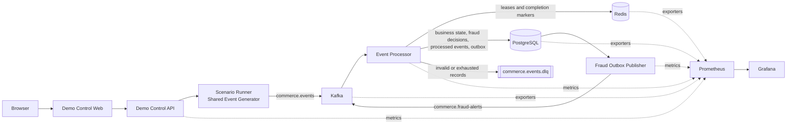

# Real-Time Commerce Platform

An event-driven commerce platform that models stateful customer journeys from
browsing through payment and refund, then processes versioned Kafka events into
durable business and fraud outcomes.

The runnable local system demonstrates the engineering guarantees behind
at-least-once workflows: idempotent consumption, transactional persistence,
bounded retries and DLQ handling, a transactional outbox, fraud evaluation,
and end-to-end observability.

[Architecture](#architecture) ·
[Engineering Highlights](#engineering-highlights) ·
[Performance](#performance-engineering) ·
[Quick Start](#sprint-10-demo-quick-start) ·
[Explore](#explore-the-project) ·
[API](#api) ·
[Testing](#testing) ·
[Troubleshooting](#troubleshooting)

## Overview

Registrations, browsing, carts, orders, payments, and refunds arrive
asynchronously. The processor validates and persists them, evaluates
deterministic fraud rules, and reliably publishes derived alerts. An
interactive Demo Control Center drives bounded scenarios and exposes live run
progress, outcomes, infrastructure health, Prometheus metrics, and provisioned
Grafana dashboards.

The repository is a compact reference implementation for inspecting streaming
failure modes—not a claim of production availability or exactly-once delivery.

## Architecture

Docker Compose runs the services on one local network. Kafka uses a single
KRaft broker/controller for the development topology; PostgreSQL is the durable
system of record, while Redis contains reconstructible coordination state.



The processor commits source-event identity, commerce effects, fraud results,
and outbox rows in one PostgreSQL transaction. Redis leases coordinate active
processing, PostgreSQL uniqueness protects durable effects, and Kafka offsets
are committed only after terminal handling. Delivery is **at least once**;
ordering is partition-scoped rather than global.

## Engineering Highlights

- **Versioned event contracts:** shared Pydantic envelopes and payload models
  provide one producer/consumer validation boundary.
- **Idempotent Kafka processing:** Redis token-checked leases coordinate work;
  PostgreSQL constraints prevent duplicate durable side effects.
- **Transactional consistency:** a Unit of Work commits business state, fraud
  decisions, and outbox records atomically per accepted source event.
- **Bounded failure handling:** classified transient failures retry with capped
  backoff; invalid or exhausted records follow a confirmed DLQ path.
- **Reliable derived events:** a separate publisher claims committed outbox
  rows and publishes fraud alerts with at-least-once delivery.
- **Operability and evidence:** bounded-label Prometheus metrics, provisioned
  Grafana dashboards, deterministic scenarios, and retained benchmark artifacts
  make behavior inspectable and reproducible.

## Performance Engineering

The performance work follows a repeatable loop: profile the real path, isolate
one bottleneck, test one hypothesis under steady-state load, then retain or
revert the change based on system-level evidence.

### Benchmark scopes

| Scope | Path measured | What the rate means |
| --- | --- | --- |
| **Demo full path** | Demo Control API → Scenario Runner → Kafka → processor → persistence | End-to-end generation and processing through the interactive application path. |
| **Isolated processor pipeline** | Benchmark-only direct injector → Kafka → processor → Redis/PostgreSQL | Processor saturation without the Demo API or Scenario Runner limiting input. |

These scopes are intentionally separate: the isolated three-worker result is
not a continuation of the Demo full-path series and must not be read as a
“49 → 750 evt/s” optimization.

### Performance engineering journey

| Stage | Observation | Change or experiment | Artifact-backed result |
| --- | --- | --- | --- |
| Initial Demo full path | A 100 evt/s request produced much less traffic although handler latency was low. | Profile Scenario Runner. | **49.843 evt/s median**. |
| Generator hot path | Synchronous progress refresh and `work(); sleep(1/rate)` extended every event period. | Coalesce refresh work off the event loop; use monotonic fixed-rate deadlines. | Same Demo full-path benchmark reached **97.934 evt/s median**. |
| Transaction decomposition | Payment-history reads dominated measured PostgreSQL work; commit and pool acquire did not. | Measure SQL classes and transaction stages before changing the database path. | Recent/prior lookups identified as the expensive query class. |
| Combined payment lookup | Fewer SQL round trips might reduce transaction cost. | Combine recent/prior reads in one controlled query. | Steady-state throughput and latency regressed; **reverted**. |
| Query-plan optimization | Payment-history predicates used a `Seq Scan`. | Add `payments(customer_id, attempted_at DESC)`. | Recent **10.897 → 0.253 ms**; prior **7.143 → 0.100 ms**; transaction average roughly **6.9–7.5 → 1.7–1.8 ms**. |
| Isolated single processor | The Demo path could no longer feed the processor fast enough to locate its ceiling. | Introduce a benchmark-only direct Kafka injector. | Approximately **500 evt/s sustainable** with one serial worker. |
| Two-worker scaling | A second consumer should increase service capacity. | Run two consumers in the same group against three partitions. | At 600 requested, service rose roughly **502.0 → 584.5 evt/s** and lag growth fell **+90.7 → +10.4 evt/s**; the 2/1 partition assignment limited linear scaling. |
| Three-worker alignment | Kafka partition assignment bounded useful consumer concurrency. | Match three workers to three partitions for a 1/1/1 assignment. | At 750 requested, the isolated pipeline delivered **742.185 evt/s service rate** sustainably. |
| Boundary refinement | Processed rate alone could hide accumulating backlog. | Repeat steady-state tests above 750 and classify by lag slope and drain behavior. | 775 was non-sustainable in all repeats: **+52.9 / +86.8 / +93.4 evt/s** lag growth; transition **750–775 evt/s**. |

The rejected combined-query experiment is retained as evidence of the decision
process: reducing two SQL statements to one did not reduce total execution
cost, and the change was removed when the steady-state benchmark contradicted
the hypothesis.

> **Local benchmark environment:** Results were measured under the documented
> workload in a local Docker environment. The ~750 evt/s result applies only to
> the isolated `Kafka → processor → persistence` path with three processor
> workers and three Kafka partitions. It is a comparative engineering result,
> not Demo full-path throughput or production capacity. Rates at 775, 800, 850,
> and 900 evt/s were boundary/saturation tests, not achieved capacity claims.

Follow the evidence from the [Performance Report](docs/performance-report.md)
→ [Methodology](docs/performance/methodology.md)
→ [Optimization History](docs/performance/optimization-history.md)
→ [Scaling Analysis](docs/performance/scaling-analysis.md)
→ [Raw Artifact Index](artifacts/benchmark/README.md).

## Sprint 10 demo quick start

### 1. Prerequisites

- Git
- Docker Desktop (or Docker Engine)
- Docker Compose
- GNU Make

Confirm Docker is running before continuing:

```bash
docker compose version
```

### 2. Clone the repository

```bash
git clone https://github.com/negativexq/real-time-commerce-platform.git
cd real-time-commerce-platform
```

### 3. Environment setup

No environment configuration is required for the local demo; Docker Compose
provides safe local defaults. To inspect or customize ports and other settings,
copy the provided template before startup:

```bash
cp .env.example .env
```

> Keep `.env` local and never add real credentials to it.

### 4. Start the entire demo environment

```bash
make demo-up
```

This builds and starts Kafka, PostgreSQL, Redis, the processor, fraud outbox
publisher, observability services, Demo Control API, and Demo Control Web. The
first startup may take a few minutes while images build and services become
healthy.

### 5. Verify the stack

```bash
make demo-status
make demo-api-health
make demo-web-health
```

The long-running services should show `Up`; services with health checks should
show `healthy`. The two health commands should return successfully. If services
are still starting, wait briefly and run these commands again.

### 6. Open the platform

| Service | URL |
| --- | --- |
| Demo Dashboard | <http://localhost:3003> |
| API Docs | <http://localhost:8082/docs> |
| Kafka UI | <http://localhost:8080> |
| Prometheus | <http://localhost:9090> |
| Grafana | <http://localhost:3002> |

### 7. Run your first demo

1. Open the [Demo Dashboard](http://localhost:3003).
2. Select **Launch Scenario** on the Overview, or **Scenarios** in the sidebar.
3. Choose **Normal customer** and keep the default bounded settings.
4. Select **Start scenario**.
5. Watch the run page update as events are generated and processed. The run
   should reach **COMPLETED**, with APPROVE decisions and no fraud alert.
6. Return to **Overview** to see the updated run, throughput, decision, and
   platform-health data.

### 8. Expected initial behavior

> **Waiting for traffic** is expected before the first scenario starts.
> Processor rates and latency metrics become available after events are
> generated and Prometheus completes a scrape.

### 9. Stop the environment

Stop and remove the project containers while preserving local data:

```bash
make clean
```

To perform a full reset, including all persisted local project data:

```bash
make clean-volumes
```

> **Warning:** `make clean-volumes` removes the project’s named volumes and
> local demo data. Use it only when you intentionally want a clean slate.

### 10. Quick troubleshooting

- **Ports already in use:** Stop the conflicting local process, or copy
  `.env.example` to `.env` and change the corresponding host-port setting.
- **Services still starting:** Run `make demo-status` until the long-running
  services are `Up` and health-checked services report `healthy`.
- **Dashboard shows “Waiting for traffic”:** Launch **Normal customer** from
  **Scenarios**, then allow Prometheus one scrape interval to update.
- **Rebuild the Docker stack:** Run `make demo-build`, followed by
  `make demo-up`.

If the primary processor has historical lag, use the isolated, non-destructive
takeover acceptance workflow documented in
[Interactive Demo Control Center](docs/demo-control-center.md); never reset the
primary consumer group offsets.

## Repository Structure

| Path | Purpose |
| --- | --- |
| `.github/` | GitHub Actions CI configuration. |
| `apps/` | Next.js Demo Control Web application. |
| `database/` | First-run SQL and ordered, checksum-verified migrations. |
| `docs/` | Detailed contracts, service behavior, operations, and architecture notes. |
| `infra/` | Prometheus rules/configuration and provisioned Grafana resources. |
| `infrastructure/` | Kafka topic initialization script. |
| `scripts/` | Deterministic smoke, verification, and scoped cleanup utilities. |
| `services/` | Generator, processor, outbox publisher, and Demo Control API services. |
| `shared/` | Versioned event schemas, common domain helpers, Kafka metadata, and metrics. |
| `tests/` | Python unit tests and event fixtures. |

Root-level orchestration lives in `compose.yaml`, `Makefile`, `.env.example`,
and `pyproject.toml`.

## Technology Stack

| Area | Technologies |
| --- | --- |
| Language | Python 3.12+, TypeScript 5 |
| Backend | FastAPI, Pydantic v2, Uvicorn, psycopg 3, httpx, structlog |
| Frontend | Next.js App Router, React, Tailwind CSS, Recharts |
| Messaging | Apache Kafka 3.9 in KRaft mode, `confluent-kafka` |
| Storage | PostgreSQL 17, Redis 7 |
| Observability | Prometheus, Grafana, Kafka/PostgreSQL/Redis exporters, `prometheus-client` |
| Tooling | Docker Compose, GNU Make, Ruff, mypy, pytest, Vitest |

Dependencies are pinned in `pyproject.toml`, `apps/demo_control_web/package.json`,
and `compose.yaml`. The selected container images support ARM64 and AMD64.

## Design Patterns

| Pattern | How it is used |
| --- | --- |
| Event-driven architecture | Stateful commerce journeys communicate through explicit Kafka topics rather than direct service calls. |
| Versioned contracts | A shared envelope and payload registry provide one validation and serialization boundary for producers and consumers. |
| Consumer groups | The processor scales through Kafka partition assignment while committing offsets manually after terminal handling. |
| Idempotent consumer | Redis leases coordinate active work; PostgreSQL uniqueness prevents repeated durable business effects for the same event. |
| Unit of Work | Each valid source event and its business/fraud effects commit in one explicit PostgreSQL transaction. |
| Bounded retry | Only classified transient failures retry, using capped backoff; terminal failures follow the DLQ path. |
| Dead Letter Queue | Invalid or exhausted records are published to `commerce.events.dlq` and recorded for bounded inspection. |
| Transactional outbox | Fraud alerts and outbox rows commit together, then a separate publisher delivers the Kafka alert. |
| Read models | PostgreSQL business tables and demo manifests support queries without replaying the event stream. |
| Observability | Bounded-label metrics, health probes, recording rules, and provisioned dashboards expose behavior and failure state. |

The project does not implement event sourcing or claim CQRS as a system-wide
architecture: PostgreSQL remains the durable business record.

## Explore the Project

The Demo Dashboard is the fastest way to explore the system:

- **Overview** — current run scope, throughput, lag, latency, fraud decisions,
  recent alerts, and service health.
- **Scenarios** — eight fixed scenarios covering normal traffic, suspicious
  payments, account takeover, bot checkout, refund abuse, duplicates, malformed
  events, and mixed traffic.
- **Runs** — live SSE progress, run history, exact outcomes, stop, and safe
  retry controls.
- **Fraud** — recent evaluations, explainable alerts, scores, severities, and
  outbox state.
- **DLQ** — sanitized validation/processing failures and Kafka source metadata.
- **Infrastructure** — dependency health derived from real checks.
- **Dashboards** — links to the seven provisioned Grafana dashboards.

For implementation details, see:

- [Event contracts](docs/event-contracts.md)
- [Event generator](docs/event-generator.md)
- [Personas and anomalies](docs/personas-and-anomalies.md)
- [Event processor](docs/event-processor.md)
- [PostgreSQL persistence](docs/postgresql-persistence.md)
- [Fraud engine and outbox](docs/fraud-engine.md)
- [Prometheus and Grafana](docs/observability.md)
- [Demo Control Center](docs/demo-control-center.md)

## Observability

Prometheus scrapes the processor, generator, outbox publisher, Demo Control
API, and infrastructure exporters every 10 seconds. Metrics use bounded labels;
run IDs and business identifiers are deliberately excluded.

The demo surfaces:

- received and processed event rates;
- processing latency histograms and p95 latency;
- Kafka consumer-group lag;
- validation failures, retries, duplicates, and DLQ publications;
- PostgreSQL and Redis operation outcomes;
- APPROVE, REVIEW, and BLOCK decision rates;
- fraud alerts and outbox pending/publication state;
- application health and exporter target health.

Grafana provisions Platform Overview, Kafka Streaming, Processor, Persistence,
Fraud, Outbox, and Infrastructure dashboards from `infra/observability/`.
During a demo, use the web Overview for concise run context and Grafana for
platform-wide time series. Run-specific counts come from PostgreSQL, not
Prometheus.

Useful checks:

```bash
make prometheus-targets
make prometheus-query-smoke
make grafana-health
make grafana-dashboards-check
```

## API

FastAPI publishes interactive Swagger/OpenAPI documentation at
<http://localhost:8082/docs>. The stable API is under `/api/v1`; the table
below describes route groups rather than duplicating the generated schema.

| Routes | Purpose |
| --- | --- |
| `GET /health`, `GET /ready` | Process liveness and PostgreSQL-backed readiness. |
| `GET /scenarios`, `GET /scenarios/{scenario_type}` | Inspect the fixed scenario catalog and bounded options. |
| `POST /runs`, `GET /runs`, `GET /runs/{run_id}` | Start a scenario and inspect paginated run history or one run. |
| `POST /runs/{run_id}/stop`, `POST /runs/{run_id}/retry` | Gracefully stop active work or safely create a retry run. |
| `GET /runs/{run_id}/summary`, `/timeline`, `/stream` | Read exact outcomes, a bounded timeline, or live SSE progress. |
| `GET /overview/fraud-summary` | Select one active/latest run and return a consistent fraud summary for Overview. |
| `GET /platform/health`, `/metrics/summary`, `/topics`, `/services` | Read cached health and restricted platform metadata/metrics. |
| `GET /fraud/alerts`, `/fraud/evaluations`, `/fraud/alerts/{alert_id}` | Inspect bounded, sanitized fraud results. |
| `GET /dlq`, `GET /dlq/{event_id}` | Inspect bounded DLQ metadata and error details. |
| `GET /dashboards` | Discover provisioned Grafana dashboards and URLs. |
| `DELETE /runs/{run_id}/test-data` | Remove only terminal, run-scoped demo data. |

Prefix each route above with `/api/v1`. Prometheus scrapes the API's separate
`/metrics` endpoint. The API intentionally exposes neither arbitrary SQL nor
arbitrary PromQL.

## Testing

### Backend

Create a Python 3.12 virtual environment and install the pinned application plus
development dependencies:

```bash
python3.12 -m venv .venv
source .venv/bin/activate
python -m pip install -e ".[dev]"
make check
```

`make check` runs Ruff linting, Ruff format validation, strict mypy, and pytest.
Individual checks are also available:

```bash
make lint
make format-check
make type-check
make test
make compose-config
```

### Frontend

```bash
cd apps/demo_control_web
npm ci
npm test
npm run typecheck
npm run build
```

The package currently has no working standalone lint or format check:
`npm run lint` still references the `next lint` command removed by the installed
Next.js version. TypeScript checking, Vitest, and the production build are the
verified frontend quality gates until that script is replaced.

### Runtime smoke tests

Smoke tests use bounded inputs and repository-managed containers:

```bash
make storage-smoke
make kafka-smoke
make processor-smoke
make fraud-outbox-smoke
make observability-smoke
make demo-ui-smoke
```

`make demo-smoke` exercises the main allow-listed demo scenarios. On a retained
Kafka volume with significant processor lag, use the isolated acceptance
workflow in [Demo Control Center](docs/demo-control-center.md) instead of
resetting the primary consumer-group offsets.

## Data Safety

Named volumes retain Kafka, PostgreSQL, Redis, Prometheus, and Grafana state:

| Volume | Contents |
| --- | --- |
| `real-time-commerce-platform-kafka-data` | Kafka metadata and messages |
| `real-time-commerce-platform-postgres-data` | Durable business and demo-run data |
| `real-time-commerce-platform-redis-data` | Redis append-only operational state |
| `real-time-commerce-platform-prometheus-data` | Prometheus time series |
| `real-time-commerce-platform-grafana-data` | Grafana local state |

`make clean` preserves these volumes. `make clean-volumes` deletes all five and
should only be used for an intentional local reset. Run cleanup is scoped by
run manifest/test scope; it never truncates tables, deletes topics, or flushes
Redis.

## Troubleshooting

### Docker services are still starting

```bash
make demo-status
docker compose --profile processor --profile fraud --profile observability \
  --profile demo logs --tail=100
```

Wait for long-running services to report `Up` and for health-checked services
to report `healthy`. First-time image builds take longer.

### A host port is already in use

All published interfaces bind to `127.0.0.1`. Stop the conflicting process, or
copy `.env.example` to `.env` and change the corresponding host-port variable.
If changing a public web/API URL, update its matching `DEMO_WEB_PUBLIC_*`
setting as well.

### Dashboard shows “Waiting for traffic”

This is normal before metrics have samples. Start **Normal customer** from the
Scenarios page, wait for one 10-second Prometheus scrape, then refresh:

```bash
make demo-run-normal
```

### Metrics are unavailable

Check Prometheus readiness and scrape targets:

```bash
curl -fsS http://localhost:9090/-/ready
make prometheus-targets
make metrics-endpoints
```

If Prometheus is healthy but an application target is down, inspect the
relevant service with `make demo-status` and the profile logs above.

### Rebuild the demo stack

```bash
make demo-build
make demo-up
make demo-api-health
make demo-web-health
```

This rebuild preserves named volumes. Avoid `make clean-volumes` unless data
loss is intentional.

## Future Work

Meaningful next steps, none of which are implemented today:

- define cloud infrastructure with Terraform and add Kubernetes deployment
  manifests rather than relying only on local Compose;
- add CI-owned benchmark smoke tests with explicit regression thresholds while
  keeping full saturation runs outside routine pull-request checks;
- run longer soak and failure-recovery tests on dedicated infrastructure;
- isolate PostgreSQL, Kafka, and storage behavior beyond the current
  three-worker boundary before attempting further application optimization.

## License

This project is licensed under the MIT License. See the [LICENSE](LICENSE) file
for details.
