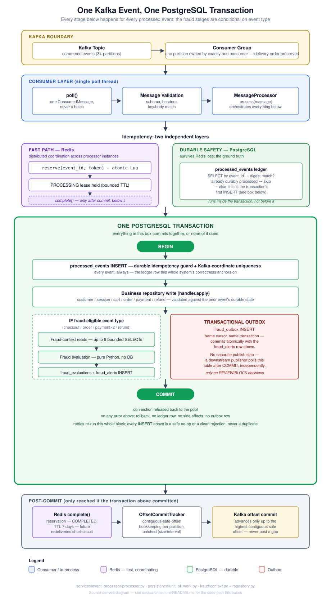
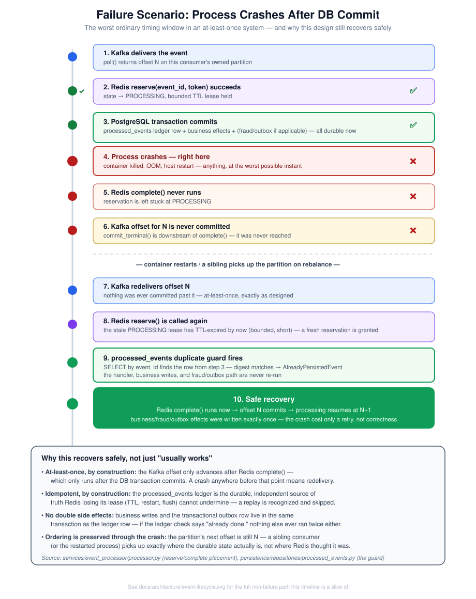
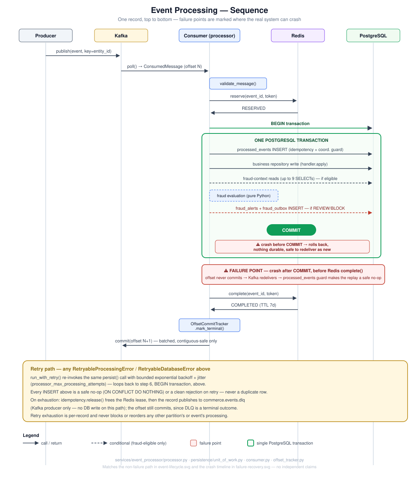

# Event Processor Architecture

Diagrams and a design-decisions record tracing the actual code path for
one Kafka event through the processor, derived directly from
[`services/event_processor/processor.py`](../../services/event_processor/processor.py),
[`persistence/unit_of_work.py`](../../services/event_processor/persistence/unit_of_work.py),
and [`fraud/context.py`](../../services/event_processor/fraud/context.py) +
[`fraud/repository.py`](../../services/event_processor/fraud/repository.py) -
not an idealized or aspirational design. They are static, documentation-only
artifacts; no runtime behavior changed to produce them.

## Design Decisions

[`design-decisions.md`](design-decisions.md) explains *why* the system is
built this way - Redis + PostgreSQL idempotency, at-least-once delivery,
the transactional outbox, partition-scoped ordering, and why persistence
batching and unbounded worker scaling were each rejected - as
Problem/Considered alternatives/Decision/Trade-off, tied back to the
specific benchmark stages (Stage 28-31) that produced the evidence.

## [`event-lifecycle.svg`](event-lifecycle.svg) - the full path

Traces one event from Kafka delivery through to a committed Kafka offset:

- **Kafka boundary** - topic and consumer-group partition ownership, the
  mechanism that keeps delivery order scoped to a partition.
- **Consumer layer** - the single poll thread: `poll()` → validation →
  `MessageProcessor.process()`.
- **Idempotency, two independent layers** - Redis `reserve()`/`complete()`
  as the fast, distributed coordination path, and the `processed_events`
  ledger as the durable safety net that survives Redis losing state
  entirely. The diagram is explicit that the ledger check is the *first
  statement inside* the transaction below, not a separate step before it.
- **One PostgreSQL transaction** - the ledger insert, business repository
  write, and (conditionally, for fraud-eligible event types) fraud-context
  reads, evaluation, and fraud/outbox persistence all commit or roll back
  together. The transactional-outbox row is called out specifically: it
  shares a cursor and a transaction with the fraud alert it documents, so
  there is no separate publish step and no window where one could exist
  without the other.
- **Post-commit** - Redis `complete()`, the `OffsetCommitTracker`'s
  contiguous-safe-offset bookkeeping, and the Kafka offset commit itself,
  which only ever advances up to a fully contiguous run of terminal
  offsets.

## [`failure-recovery.svg`](failure-recovery.svg) - crash after commit

Walks through the single worst ordinary timing window in an at-least-once
system: the process crashes *after* the PostgreSQL transaction commits but
*before* Redis `complete()` and the Kafka offset commit run. It shows why
that is still safe, not merely "usually fine":

- the Kafka offset is never committed past the crashed record, so
  redelivery is guaranteed;
- the stale Redis `PROCESSING` lease expires (bounded TTL) and a fresh
  reservation is granted on redelivery;
- the `processed_events` ledger - independent of Redis - recognizes the
  replay via its digest check and raises `AlreadyPersistedEvent`, so the
  handler, business writes, and fraud/outbox path never run a second time;
  Kafka's own within-partition offset ordering means whichever consumer
  picks the partition back up resumes from the durable truth, not from
  whatever Redis last believed.

## [`event-processing-sequence.svg`](event-processing-sequence.svg) - sequence view

The same lifecycle as `event-lifecycle.svg`, redrawn as a five-lane
sequence diagram (Producer, Kafka, Consumer, Redis, PostgreSQL) so the
*order and direction* of every call is explicit, alongside the two
concrete crash points and the retry path:

- a crash **before** `COMMIT` rolls the transaction back - nothing
  durable, safe to redeliver as if the event were brand new;
- a crash **after** `COMMIT` but before Redis `complete()` is the same
  window `failure-recovery.svg` walks through in detail - the offset
  never commits, so Kafka redelivers, and the `processed_events` guard
  makes the replay a safe no-op;
- the retry path shows that `run_with_retry()` re-invokes the same
  `persist()` call on any retryable error, and that retry exhaustion
  releases the Redis lease and routes to the DLQ rather than blocking or
  reordering anything else.

## Why two independent idempotency layers

Redis alone would be fast but not durable (a Redis restart, TTL expiry
under load, or data loss would erase in-flight reservations without a
fallback). PostgreSQL alone would be durable but adds a round trip to every
duplicate check that Redis can usually resolve without touching the
database at all. Together: Redis short-circuits the common case cheaply,
and the `processed_events` ledger is the fact of record whenever Redis
cannot answer authoritatively - a pattern verified in practice by the
recovery timeline above, not merely asserted.
