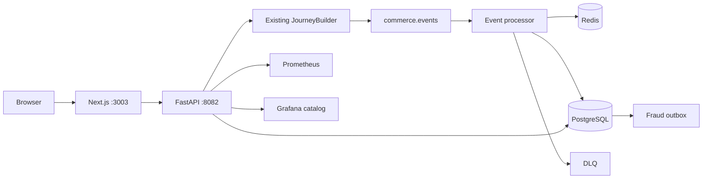
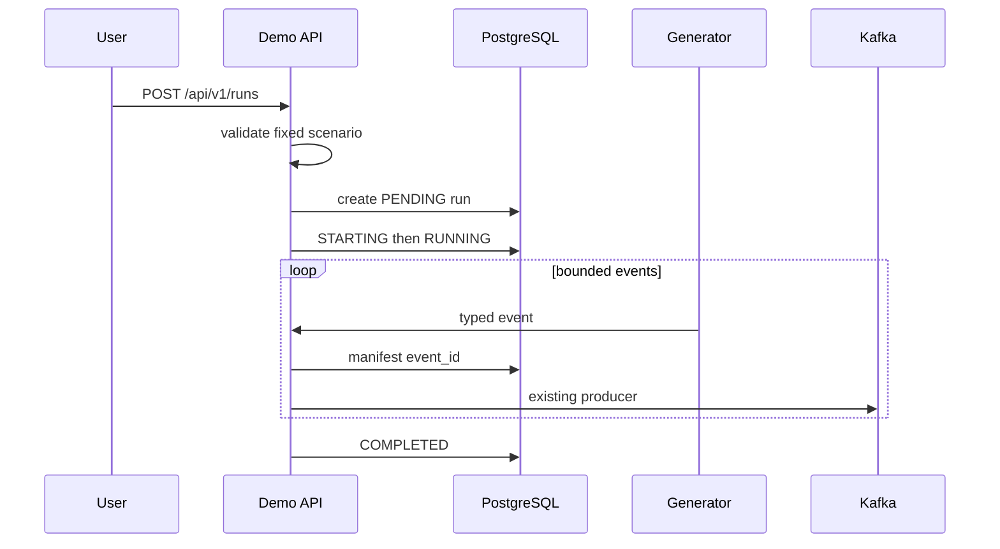
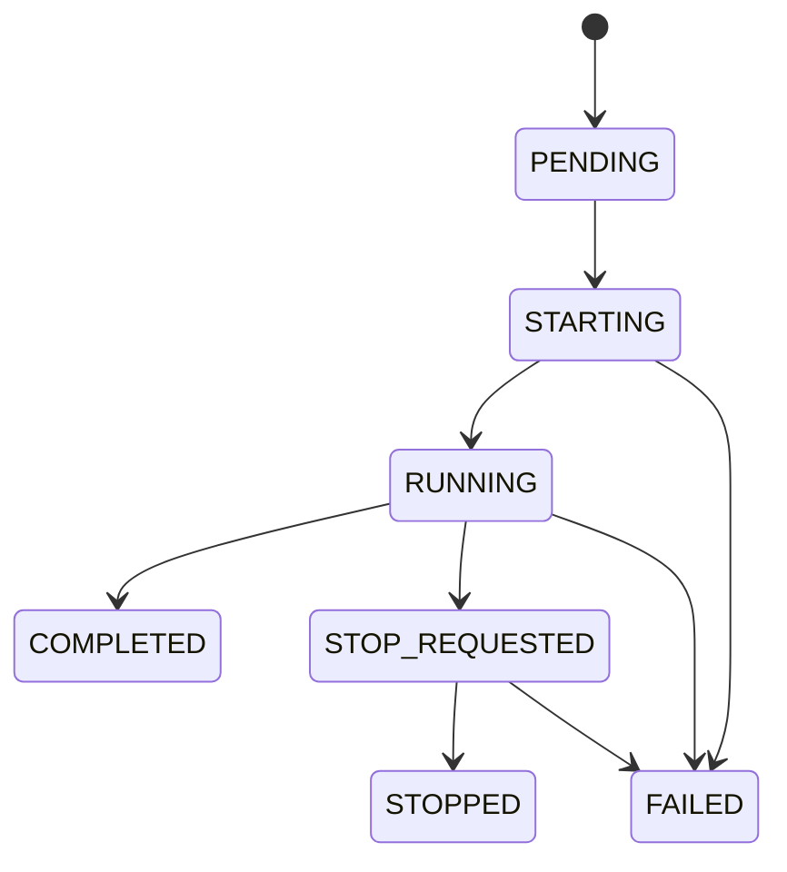
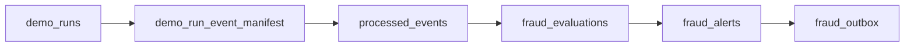
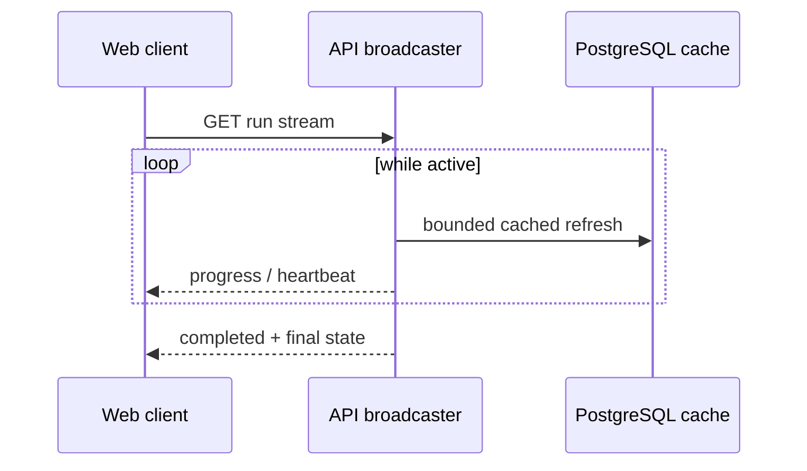
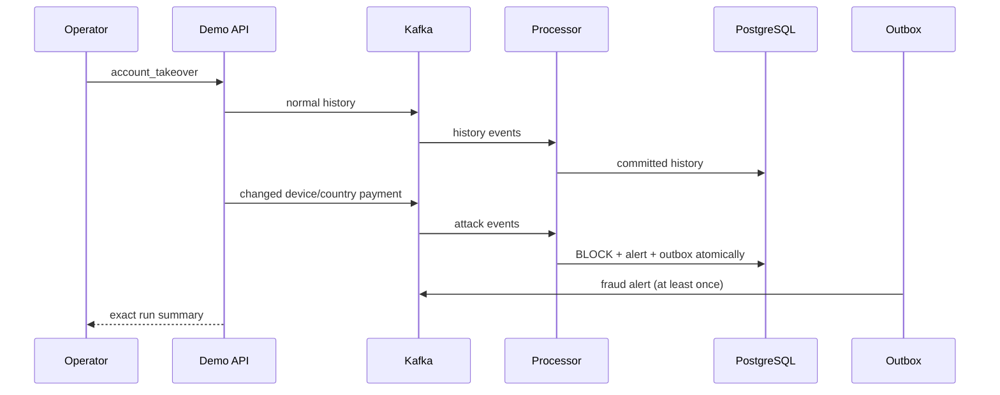

# Interactive Demo Control Center

## Purpose

Sprint 10 adds a polished local control plane for bounded demonstrations. It
starts only fixed scenarios, observes their progress, reads run-specific
outcomes from PostgreSQL, shows platform-wide Prometheus signals, and links to
the seven provisioned Grafana dashboards. It does not bypass Kafka or the
processor.

## Architecture



The API uses the generator's Python interfaces in process. There is no shell
execution, Docker socket, arbitrary Kafka payload, unrestricted SQL, or
unrestricted PromQL endpoint.

## Scenario catalog and parameters

The allow-list is `normal_customer`, `suspicious_payment`,
`account_takeover`, `bot_checkout`, `refund_abuse`, `duplicate_delivery`,
`malformed_event`, and `mixed_traffic`. Unknown names fail validation.

Requests bound event count to 1–100,000, duration to 1–3,600 seconds, rate to
1–1,000 events/second, anomaly rates to 0–0.25, and notes to 500 characters.
Mixed percentages total exactly 100. Seeds are deterministic. The web defaults
are intentionally safer than the API ceilings.



## Run model and state machine

Migration `004_demo_control_center.sql` adds `demo_runs` and
`demo_run_event_manifest`. Migrations 001–003 remain unchanged.



Creation and task start are separate internal operations. Repeated start/stop
is idempotent. The API reconciles abandoned active states on restart and never
claims that an in-memory task survived.

## Correlation, progress, and summaries

The manifest maps a run to generated `event_id` values without changing
business identifiers or strict event contracts.



Generated counts are recorded by the runner. Processed, decision, alert, and
outbox counts are exact manifest joins in PostgreSQL. Rates, consumer lag, and
latency percentiles are platform-wide Prometheus values and are clearly
labelled as such. `run_id` is never a metric label.

## API and SSE

All routes live under `/api/v1`: health/readiness, scenario catalog, run CRUD
and stream, platform health/metrics/topics/services, fraud, DLQ, dashboards,
and terminal-run cleanup. History endpoints have bounded page sizes.



SSE carries counters and status only—never payloads or sensitive identifiers.
It stops after the terminal event. The UI visibly reports stale streaming and
supports ordinary refresh as a fallback.

## Fraud, DLQ, health, and Grafana

Fraud views expose decisions, severity, scores, bounded reason codes, and
outbox state. They omit IP addresses, devices, hashes, and raw payloads. DLQ
views expose transport coordinates and bounded sanitized errors; raw payload
and replay are unavailable.

Health uses protocol checks (`SELECT 1`, Redis PING, Kafka metadata,
Prometheus readiness, and Grafana health) with a brief cache. Unknown targets
remain `UNKNOWN`; container existence is not treated as health.

The dashboard catalog links Platform Overview, Kafka Streaming, Processor,
Persistence, Fraud, Outbox, and Infrastructure by stable UID. Grafana remains
the time-series visualization system.

## Security boundary and cleanup

CORS is limited to configured frontend origins. An optional bearer token is
disabled by default. Request bodies, concurrency, duration, traffic, pages,
health refreshes, and SSE are bounded. Errors are categorized rather than
returning stack traces.

Cleanup is terminal-run-only and manifest scoped. It never truncates, deletes
topics or volumes, flushes Redis, or touches migration history. The current
safe API cleanup removes control-plane manifest/run metadata only; durable
business facts remain part of the system of record.

## Docker and workflow

```bash
make demo-config-check
make demo-up
make demo-api-health
make demo-web-health
make demo-scenarios
make demo-run-normal
make demo-run-takeover
make demo-run-duplicate
make demo-run-malformed
make demo-ui-smoke
```

UI: <http://localhost:3003>. API docs: <http://localhost:8082/docs>.



## Troubleshooting and limitations

Use `make demo-status`, `make demo-logs`, `make demo-db-status`, and the API
health endpoints. Prometheus failure degrades metric cards but does not make
run history unusable. Sprint 10 does not include authentication, production
authorization, DLQ replay, WebSockets, arbitrary scenario code, or cloud
deployment. Sprint 11 may add richer operational workflows while preserving
the fixed control boundary and data-safety rules.
