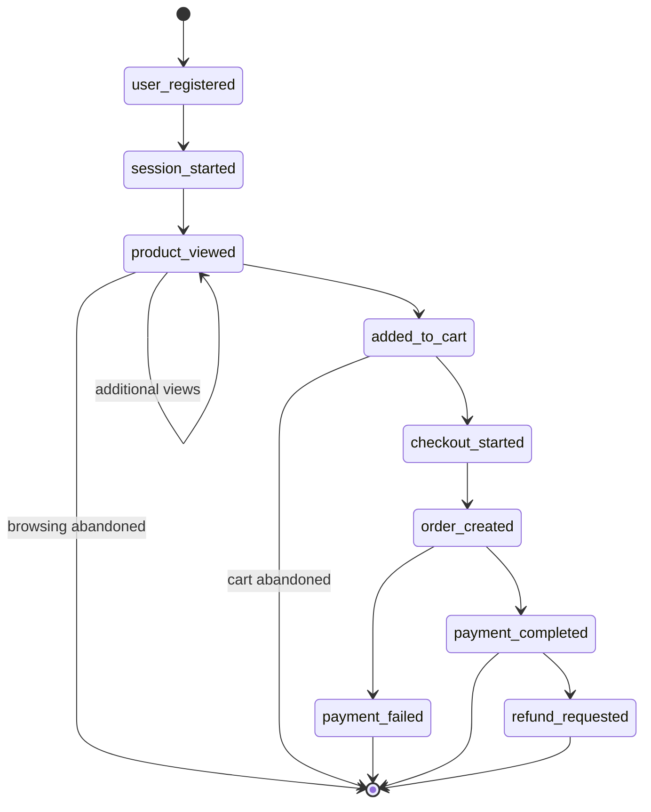

# Event generator

## Purpose and boundaries

Sprint 4 introduced the first runnable application service. Sprint 5 extends
it with process-local state, registered persona strategies, logical timing,
bounded payment retries, and optional raw-message anomalies. The event generator
creates coherent synthetic customer journeys with the shared Sprint 3
Pydantic contracts and publishes canonical JSON to `commerce.events`.

It does not consume events, persist application data, use Redis, evaluate
fraud, or produce `fraud_alert_created`. Suspicious patterns are synthetic
inputs for future systems, not classifications.

Detailed persona, state, retry, and anomaly semantics are documented in
[Stateful personas and controlled anomalies](personas-and-anomalies.md).

## Architecture

The service separates configuration, synthetic entity generation, journey
state, Kafka transport, structured logging, and application lifecycle:

- `config.py` validates environment and CLI values.
- `generator.py` owns the seeded RNG, UUID factory, and catalogue primitives.
- `journey.py` constructs typed event sequences without Kafka calls.
- `producer.py` owns Kafka metadata, callbacks, polling, and bounded flush.
- `main.py` handles CLI overrides, signals, pacing, and shutdown.
- `personas/` owns behavior profiles through one complete registry.
- `state.py` owns the bounded process-local customer pool.
- `anomalies.py` owns post-contract raw mutation and publish ordering.
- `messages.py` defines the typed producer input.
- `summary.py` records deterministic in-memory run totals.

The shared registry and payload models remain the only event schema source.

## Journey flow



Defaults:

- Add to cart: 0.55
- Checkout after cart: 0.70
- Payment success: 0.85
- Refund after success: 0.05
- Product views: 1 through 3

All identifiers remain stable through the relevant journey stages. Timestamps
are aware UTC and non-decreasing. Checkout and order reuse exact `Decimal`
totals; payment equals the order total; refunds never exceed successful
payment amounts.

## Product catalogue

The code contains four stable TRY-denominated products across electronics,
books, home, and apparel. Each entry has a deterministic UUID, category,
`Decimal` price, currency, and available quantity. No binary floats are used
for money.

## Kafka producer

The pinned Confluent Kafka client uses:

- `enable.idempotence=true`
- `acks=all`
- safe retries and at most five in-flight requests
- configurable LZ4 compression, linger, batch size, and request/delivery limits
- regular callback polling
- bounded graceful flush

Producer idempotence prevents many duplicate writes caused by producer retries.
It does not provide end-to-end exactly-once guarantees: future consumers and
side effects still require idempotency.

The UTF-8 message value is `canonical_json(event)`. The key is `customer_id`
when available, otherwise `correlation_id`. This supports per-customer
partition ordering, not global Kafka ordering.

Headers contain only:

- `event_id`
- `event_type`
- `event_version`
- `correlation_id`
- `source`
- `content_type=application/json`

## Configuration

| Environment variable | Default |
| --- | --- |
| `KAFKA_BOOTSTRAP_SERVERS` | `kafka:9092` |
| `KAFKA_EVENTS_TOPIC` | `commerce.events` |
| `KAFKA_CLIENT_ID` | `event-generator` |
| `KAFKA_COMPRESSION_TYPE` | `lz4` |
| `KAFKA_LINGER_MS` | `20` |
| `KAFKA_BATCH_SIZE` | `65536` |
| `KAFKA_DELIVERY_TIMEOUT_MS` | `30000` |
| `KAFKA_REQUEST_TIMEOUT_MS` | `10000` |
| `GENERATOR_RATE_PER_SECOND` | `1.0` |
| `GENERATOR_MAX_PRODUCT_VIEWS` | `20` (persona profiles apply lower bounds) |
| `GENERATOR_ADD_TO_CART_PROBABILITY` | `0.55` |
| `GENERATOR_CHECKOUT_PROBABILITY` | `0.70` |
| `GENERATOR_PAYMENT_SUCCESS_PROBABILITY` | `0.85` |
| `GENERATOR_REFUND_PROBABILITY` | `0.05` |
| `GENERATOR_SEED` | unset |
| `GENERATOR_LOG_LEVEL` | `INFO` |
| `GENERATOR_FLUSH_TIMEOUT_SECONDS` | `10` |
| `GENERATOR_JOURNEYS` | unset (continuous) |

CLI values override environment defaults:

```bash
python -m services.event_generator.main
python -m services.event_generator.main --journeys 10
python -m services.event_generator.main --seed 42 --journeys 10
python -m services.event_generator.main --rate 2.5 --log-level DEBUG
```

Stateful mode is enabled by default and may return to existing customers;
registration is emitted once per customer. Anomalies are disabled by default.
An integer seed stabilizes random choices and UUIDs. Unit tests additionally
inject a stepping clock, making complete typed journeys identical across runs.
Production timestamps remain real UTC time.

## Docker and Make

The generator is behind the `generator` Compose profile, has no host port, does
not depend on PostgreSQL or Redis, and uses a 320 MiB container limit.

```bash
make generator-build
make generator-up
make generator-status
make generator-logs
make generator-down

make generator-run
make generator-sample
make generator-smoke
```

`make generator-sample` publishes five seeded journeys and exits after bounded
delivery. The default `docker compose up -d` remains infrastructure-only.

## Logging and lifecycle

JSON startup logs contain only non-sensitive broker/topic/mode/rate/seed-status
and client ID. Delivery logs contain IDs plus Kafka topic/partition/offset.
Journey summaries contain correlation/customer IDs, count, terminal type, and
generation duration. Payloads, email hashes, and IP addresses are not logged.

SIGINT and SIGTERM stop new journeys, poll callbacks, perform a bounded flush,
report undelivered messages, and return non-zero for delivery failures or
remaining messages. Kafka unavailability is bounded by configured client
timeouts rather than retried forever.

## Smoke test

`make generator-smoke` runs inside the repository-managed image. It snapshots
partition end offsets, publishes two forced full-path seeded journeys, consumes
only newer messages, parses every value through the shared registry, and
checks opening order, timestamps, customer consistency, keys, and headers.
Infrastructure and topics remain intact.

## Deferred work

Consumers/processors, persistence, Redis application state, fraud/DLQ logic,
and observability remain deferred.
