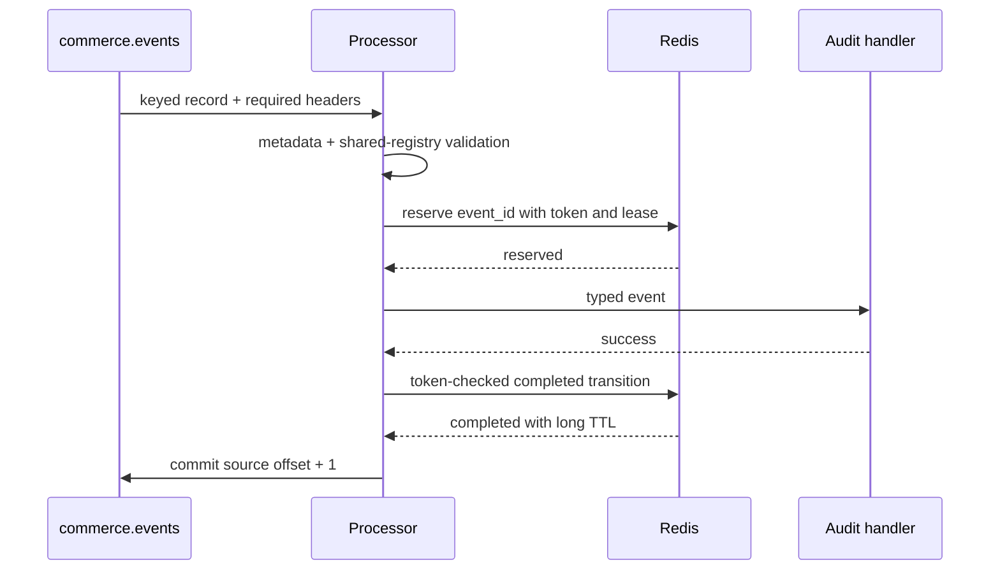
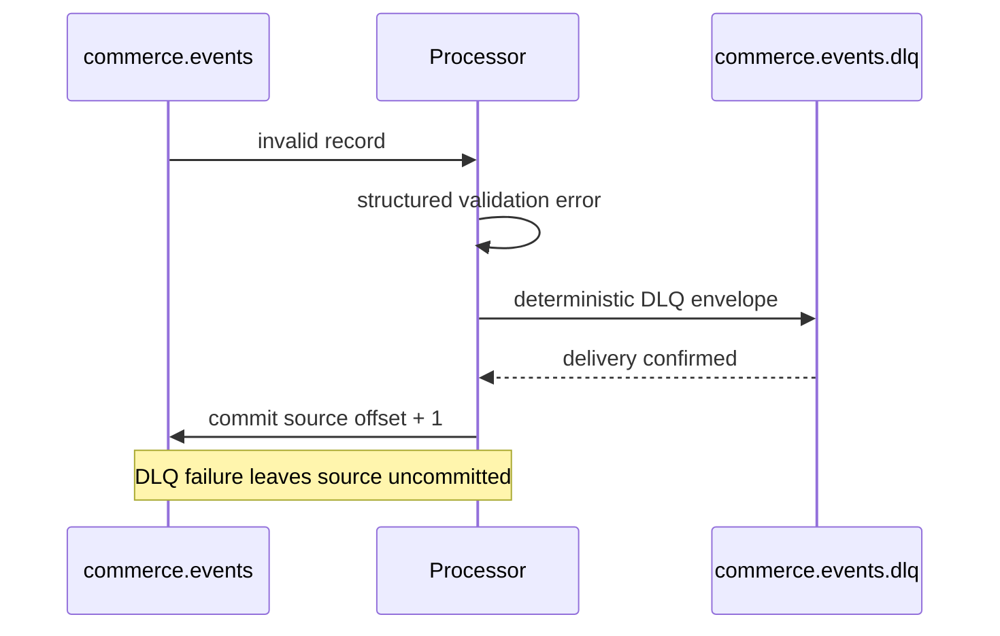
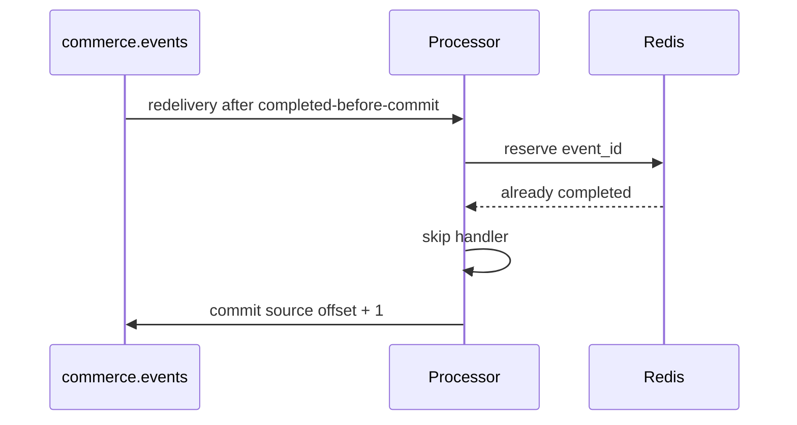
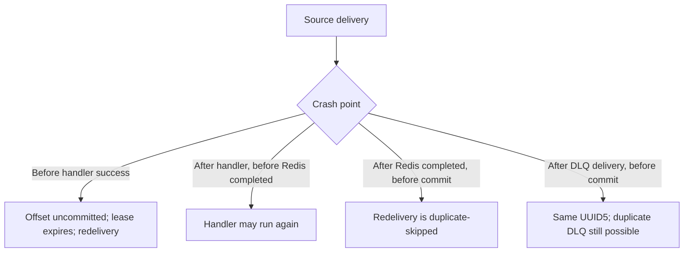

# Kafka event processor

## Purpose

Sprint 6 adds a synchronous Kafka consumer for `commerce.events`. It validates
Kafka metadata and shared Sprint 3 contracts, uses Redis leases to suppress
completed duplicates, invokes a replaceable audit handler, publishes individual
poison records to `commerce.events.dlq`, and manually commits only terminal
source records. It does not persist business events to PostgreSQL and does not
perform fraud scoring.

## Processing flows









## Validation

The processor requires a byte value, a key, and exactly one of each required
UTF-8 header: `event_id`, `event_type`, `event_version`, `correlation_id`,
`source`, and `content_type`. Duplicate required headers are rejected
deterministically. `content_type` must equal `application/json`.

The body is parsed through `shared.schemas.parse_event`, which consults
`EVENT_PAYLOAD_REGISTRY`, rejects unknown types, malformed JSON, extra fields,
payload/type mismatches, invalid UUIDs, decimals, timestamps, and enum values.
Headers are cross-checked against the parsed envelope. The expected Kafka key
is recomputed with the shared generator rule: payload `customer_id`, otherwise
`correlation_id`.

`CURRENT_EVENT_VERSION` is the sole accepted version. Non-positive versions are
contract-invalid; future versions use `unsupported_event_version` and go to
DLQ. Upcasting is intentionally deferred.

Validation categories include `missing_value`, `missing_key`, `malformed_json`,
`unknown_event_type`, `contract_validation_failed`, `missing_header`,
`duplicate_header`, `invalid_header_encoding`, `invalid_content_type`,
`header_body_mismatch`, `key_body_mismatch`, and
`unsupported_event_version`. Raw malformed bodies are never logged.

## Manual offsets and rebalance behavior

Both `enable.auto.commit` and `enable.auto.offset.store` are false. A commit
uses `processed offset + 1`, because Kafka stores the next offset to consume.
The synchronous loop has at most one in-flight record. Assignment and
revocation callbacks log topic-partitions; a revoked partition is marked
ineligible for a subsequent source commit. Invalid or exhausted messages are
committed only after confirmed DLQ delivery.

An active Redis processing lease remains unresolved and is not committed.
Finite mode exits non-zero on unresolved work. The current synchronous design
stops rather than consuming a later same-partition record, preserving partition
order. It favors auditable ownership over throughput.

## Redis idempotency

Keys use `commerce:processor:v1:event:{event_id}` by default. Values contain
only status, token while processing, consumer group, source topic/partition/
offset, and timestamps—never the event payload.

- A Lua reservation creates `processing` with NX behavior and a short TTL.
- A current processing lease prevents concurrent handling.
- Lease expiry permits atomic reclamation because the key no longer exists.
- Completion is a token-checked Lua compare-and-set to `completed`, replacing
  the short lease with the longer completed TTL.
- Release is token-checked, so a stale worker cannot delete another lease.
- A completed duplicate skips the handler and commits.

Redis is operational state and may expire or be evicted. PostgreSQL remains the
future durable system of record.

## Retry and errors

Only `RetryableProcessingError` is retried. Backoff is exponential, capped, and
optionally jittered through an injectable RNG. Attempts are bounded; tests
inject a no-op wait. Permanent validation failures never retry. Permanent
handler rejection and exhausted retryable handler failures produce a DLQ
record. Startup infrastructure failures are application failures, not message
DLQ records.

Synchronous backoff blocks later records in that partition. Operators must
keep retry bounds comfortably below `max.poll.interval.ms`; retry topics and
heartbeat-aware concurrent workers are deferred.

## DLQ schema

The processor-owned versioned DLQ envelope includes the source topic,
partition, offset and timestamp; base64 key/value bytes; sanitized allowlisted
headers; bounded error text; attempt count; processor/group identity; safe
original IDs/type; anomaly tag; and a truncation flag. It contains no stack
trace or secrets.

The record ID is UUID5 over source topic, partition, offset, and error category.
The Kafka key is original `event_id` when safely available, otherwise the source
coordinate. The producer enables idempotence and `acks=all`, waits boundedly for
delivery, and never recursively dead-letters its own failure. A crash after DLQ
delivery but before source commit can still create duplicate Kafka records;
downstream readers should deduplicate by `dlq_record_id`.

## Delivery semantics and limitations

This is at-least-once consumption with Redis-assisted idempotent processing,
not exactly once. The important crash windows are:

- Before handler success: no commit; the processing lease expires; redelivery.
- After handler success but before Redis completion: the handler may run again.
  Future side-effecting handlers must be independently idempotent.
- After Redis completion but before Kafka commit: redelivery is skipped and
  committed.
- After DLQ delivery but before source commit: deterministic identity is reused,
  but Kafka can still contain a duplicate DLQ record.

There are no Kafka transactions, retry topics, upcasters, PostgreSQL writes,
fraud decisions, metrics server, or parallel processing in Sprint 6.

## Configuration and operation

All `.env.example` variables beginning with `PROCESSOR_`, plus
`KAFKA_BOOTSTRAP_SERVERS` and `REDIS_URL`, are validated. Topics/group/prefix
cannot be blank; timing and payload limits must be positive; heartbeat must be
shorter than session timeout; initial backoff cannot exceed its cap; jitter is
between zero and one; and completed TTL must exceed processing TTL. CLI values
override the environment:

```bash
python -m services.event_processor.main
python -m services.event_processor.main --max-messages 20 --idle-timeout 10
python -m services.event_processor.main --max-messages 20 --from-beginning
python -m services.event_processor.main --group-id local-test --log-level DEBUG
```

`--from-beginning` sets `auto.offset.reset=earliest`; it does not rewrite an
existing group’s committed offsets. Smoke workflows always use unique groups.

```bash
docker compose --profile processor up -d --build event-processor
make processor-status
make processor-logs
make processor-down
```

The service has no host port. Its health check observes a local heartbeat file
updated by the poll loop. SIGINT/SIGTERM stops new polling, closes the consumer,
flushes the DLQ producer boundedly, closes Redis, and logs the run summary.

Available bounded workflows:

```bash
make processor-sample
make processor-smoke
make processor-duplicate-smoke
make processor-dlq-smoke
make processor-retry-smoke
make processor-idempotency-status
make processor-clear-test-state
```

Diagnostic key listing uses Redis `SCAN`. Test cleanup deletes only
`commerce:processor:test:*`; no workflow uses `KEYS`, `FLUSHDB`, or `FLUSHALL`.

Structured startup, processing, duplicate, retry, DLQ, debug commit, and
shutdown-summary logs contain identifiers and transport coordinates but not
payloads, credentials, email hashes, or IP addresses. The in-memory summary
tracks consumed/valid/processed/duplicate/DLQ counts, validation categories,
event types, retries, Kafka/Redis/commit failures, latency aggregates, and
unresolved records.

Future work will introduce an independently idempotent PostgreSQL persistence
handler before fraud processing. PostgreSQL is deliberately not a dependency
of this Sprint 6 service.
