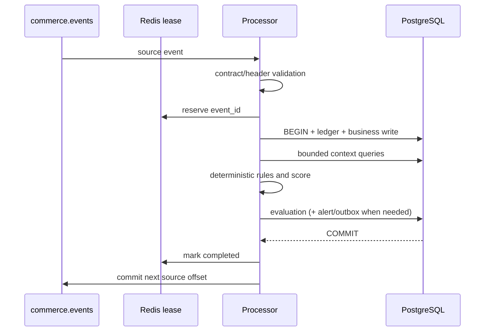
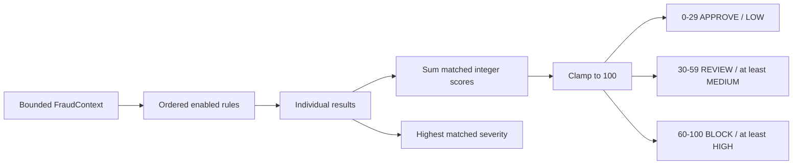
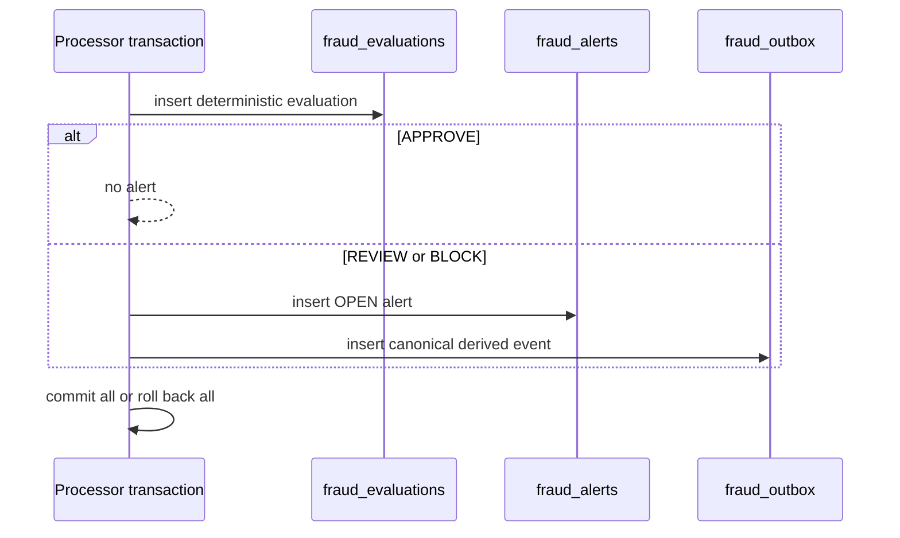
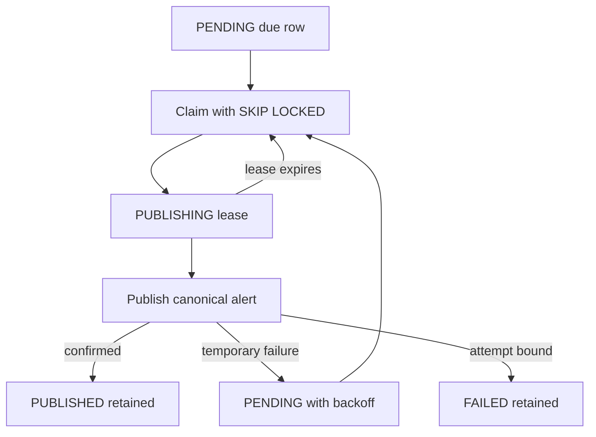
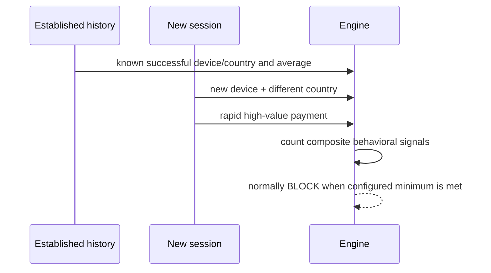

# Rule-based fraud engine

Sprint 8 adds deterministic, explainable synthetic fraud scoring to the local
portfolio platform. It is not a production fraud decision system and must not
be used to block real payments. It performs no machine learning, geolocation,
external lookup, or scoring by persona name.

## Architecture and eligible events

The source processor evaluates `checkout_started`, `order_created`,
`payment_failed`, `payment_completed`, and `refund_requested`. Registration,
session, view, and cart events are historical context only.
`fraud_alert_created` never recursively enters the engine.



Context uses the persisted current event and bounded PostgreSQL history:
customer/home country, session timing, matching-currency payment averages,
recent attempts/failures/devices/countries/orders/refunds, known successful
device/country indicators, product-view count, and refund/payment facts.
Queries use `event_time`, a configurable lookback, and a hard row limit.
Out-of-order events can only see history persisted at processing time, so late
delivery can change the available context.

## Registry, rules, and scoring

The registry is the single ordered rule source. Duplicate IDs, unknown enabled
rules, invalid maximum scores, and invalid thresholds fail configuration.
Rules are independently testable and never open database or Kafka clients.

| Rule ID | Signal |
| --- | --- |
| `high_amount` | Absolute and matching-currency historical amount deviation |
| `payment_velocity` | Bounded recent payment attempts |
| `failed_payment_burst` | Recent failures and normalized reason diversity |
| `new_device` | Unrecognized device on an established account |
| `country_mismatch` | Synthetic home/recent country differences |
| `rapid_checkout` | Short session-to-transaction interval |
| `account_takeover_composite` | Established history plus several change signals |
| `refund_abuse` | Refund frequency, timing, and normalized near-full amount |
| `bot_checkout` | High view count followed by a rapid transaction |
| `payment_amount_mismatch` | Critical persisted monetary mismatch indicator |

Persona is persisted for synthetic fixture classification and debugging only.
It is deliberately absent from `FraudContext`; behavior is the only input.



The defaults are REVIEW at 30 and BLOCK at 60, validated as
`0 <= review < block <= 100`. Scores are non-negative integers; monetary
comparisons are `Decimal`. There are no hidden weights. A critical matched rule
keeps CRITICAL severity. Evaluation IDs are UUIDv5 values derived from source
event ID plus ruleset version, so identical input and ruleset are stable.

## Persistence, alerts, and outbox

`fraud_evaluations` has one row per eligible source event. APPROVE persists only
that row. REVIEW and BLOCK atomically persist an OPEN `fraud_alerts` row and one
`fraud_outbox` row. Deterministic evaluation, alert, alert-event, and outbox IDs
make redelivery conflict detection explicit.



The derived event reuses the exact shared `fraud_alert_created` v1 contract and
canonical serializer. It inherits correlation ID, adds `causation_id` to Kafka
headers, identifies `fraud-engine` as source, keys normally by customer, and is
sent only to `commerce.fraud-alerts`.

The separate publisher claims rows with `FOR UPDATE SKIP LOCKED`, marks a
short-lived lease, publishes outside a long database transaction, confirms
Kafka delivery, and marks the row PUBLISHED. Expired PUBLISHING leases return
to PENDING. Retries use bounded exponential backoff; exhausted records remain
FAILED and are never sent to the source DLQ.



There is an unavoidable crash window after Kafka confirms delivery but before
PostgreSQL records PUBLISHED. Recovery may publish the same bytes again.
The derived event ID is deterministic, so downstream consumers must deduplicate
by `event_id`. This is at-least-once publication, never exactly once. Source
processing is already complete and is not rolled back by later outbox failure.



## Configuration and operation

All `FRAUD_*` defaults are documented in `.env.example`. Money and rate values
parse as Decimal; score/range and threshold relationships are validated.

```bash
make fraud-config-check
make fraud-rules
make db-migrate
docker compose --profile processor --profile fraud up -d --build \
  event-processor fraud-outbox-publisher
make fraud-db-status
make fraud-smoke
make fraud-outbox-smoke
```

The default infrastructure-only `docker compose up -d` remains unchanged.
The publisher has no host port, runs as a non-root user, writes a health
heartbeat, and honors bounded shutdown.

Evaluation logs identify event/evaluation/customer, score, decision, severity,
matched rule IDs, ruleset, and duration. Alert/outbox logs use identifiers,
status, attempts, delivery metadata, and bounded errors. Raw payloads, IPs,
device IDs, and email hashes are excluded from human-readable explanations.

Current limitations include synthetic input, simple bounded SQL features,
processing-time availability for late events, no currency conversion, no case
workflow, and at-least-once derived delivery. A future ML model can implement
the same rule-like evaluation boundary and produce explainable results without
changing the source transaction or outbox contract.

Sprint 9 exports bounded rule, decision, score-histogram, alert, and outbox
metrics. Persona is deliberately absent from every fraud metric label. See
[Prometheus and Grafana observability](observability.md).
