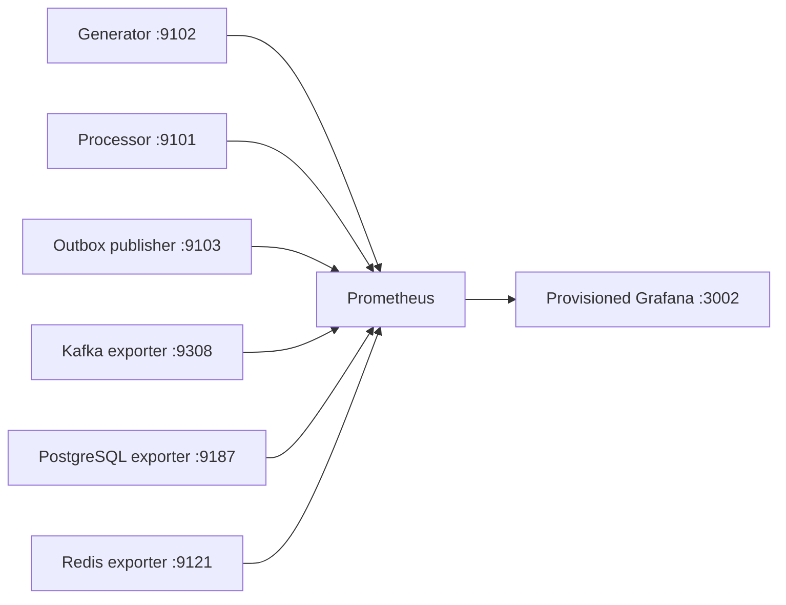
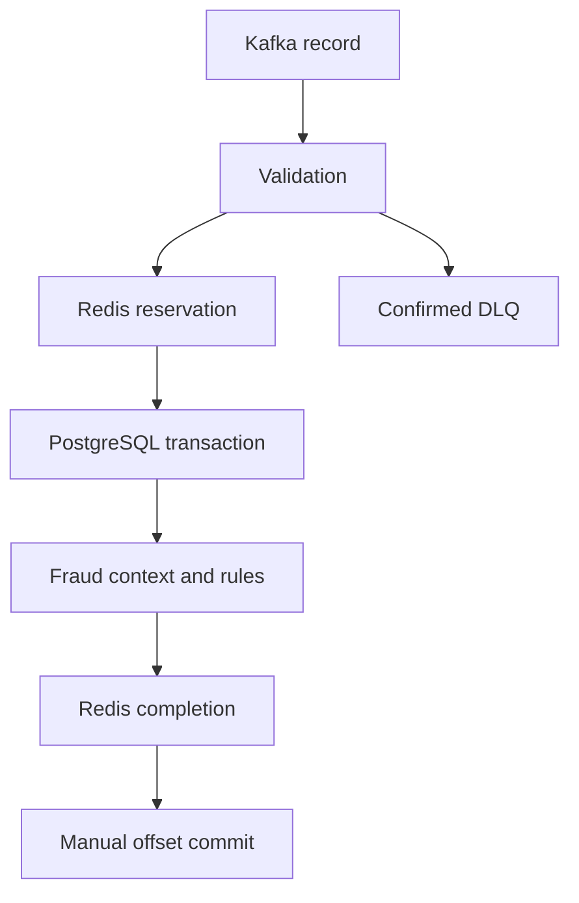
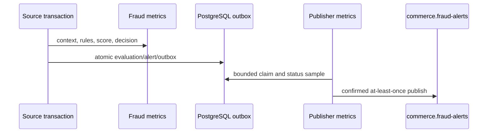
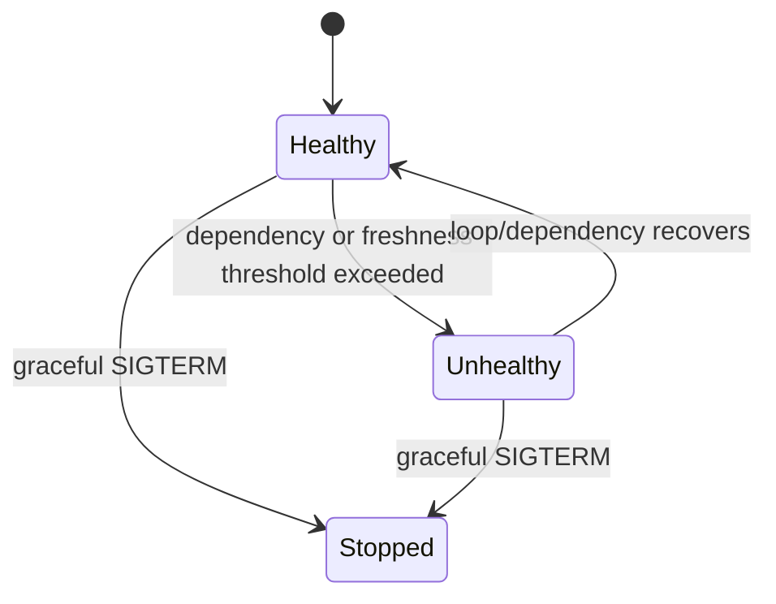
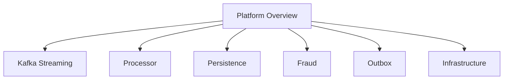

# Prometheus and Grafana observability

## Architecture and metric policy

Sprint 9 adds visibility without moving a processing boundary. Metrics are
non-critical side effects: Prometheus availability cannot change validation,
PostgreSQL commit, Redis completion, Kafka offset commit, fraud scoring, or
outbox delivery. Application endpoints run on background HTTP threads and stop
gracefully.



Metrics use `commerce_`, snake case, `_total` counters, `_seconds` durations,
and `_bytes` sizes. Labels are bounded enums or registries. Customer, event,
order, payment, correlation and device IDs, IPs, email hashes, Kafka keys,
payloads, SQL, exception text, and raw exception types are prohibited. Persona
appears only on synthetic generator metrics and never in fraud metrics.



Processor metrics cover received/terminal outcomes, validation categories,
retries, DLQ, commits, rebalances, shutdown, latency, in-flight work,
assignment, timestamps, and health. Redis metrics cover bounded operation and
result values; exporter metrics supply memory, clients, commands, hits/misses,
evictions, and expirations. No `KEYS` scan is introduced.

Persistence metrics cover transaction results, allowlisted tables, pool state,
acquisition, slow operations, and latency. PostgreSQL exporter supplies
connections, database size, transactions, deadlocks, tuple activity, and cache
inputs. It uses the existing local-development owner DSN; production should
manage a separate `pg_monitor` credential. No migration 004 is required.

## Fraud, outbox, and generator



Fraud metrics expose decisions, severities, registered rule IDs, rule outcomes,
alerts, failures, latency, score buckets 0–100, and freshness. Outbox metrics
separate claim/recovery/publication outcomes, cached pending/publishing/failed
rows, oldest age, latency, freshness, and health. Historical published rows are
not counted on every refresh. Generator metrics cover event/persona generation,
publish outcomes, controlled anomalies, journey latency, active customers,
configured rate, and health.

## Consumer lag and health

`kafka-exporter` reads broker log-end offsets and committed group offsets from
`kafka:9092`; dashboards use `kafka_consumergroup_lag`. Lag is never inferred
from message count or Kafka UI. In single-node KRaft, series may be absent
before a group commits or briefly during metadata/assignment convergence.

Existing heartbeat files remain. Services also export `commerce_service_up`,
`commerce_service_healthy`, last-success, and start-time gauges. Health is
recoverable, so one transient error does not latch a service unhealthy.



Thresholds are `HEALTH_MAX_POLL_STALENESS_SECONDS`,
`HEALTH_MAX_SUCCESS_STALENESS_SECONDS`,
`HEALTH_MAX_OUTBOX_STALENESS_SECONDS`, and
`METRICS_REFRESH_INTERVAL_SECONDS`.

## Prometheus, exporters, rules, and Grafana

Prometheus uses Compose DNS, a ten-second interval, five-second timeout, and
seven-day/2 GB local retention. Recording rules cover processor rates, error
ratio and p95, Kafka lag, fraud decisions, and outbox backlog/age. Local-demo
alerts cover processor down, lag, DLQ, database/Redis availability, outbox
backlog/failure, and latency. There is no receiver or paging integration.

Pinned images are Prometheus 3.12.0, Grafana 13.1.0, Kafka exporter 1.9.0,
PostgreSQL exporter 0.17.1, and Redis exporter 1.74.0. Exporters remain internal
and have healthchecks, restart policies, and conservative memory limits.

Datasource UID `commerce-prometheus` and seven dashboards are provisioned from
read-only Git mounts. Counters use rates or bounded increases.



The dashboards cover the platform landing view, committed Kafka lag, processor
paths, persistence/pool health, rule-based fraud, the source-complete versus
derived-publication-pending outbox distinction, and infrastructure exporters.
New queries use `commerce.fraud-alerts`, never legacy `commerce.fraud.alerts`.

## Operation, smoke tests, and troubleshooting

```bash
make observability-config-check
make observability-up
make observability-status
make prometheus-targets
make prometheus-query-smoke
make metrics-endpoints
make metrics-smoke
make grafana-health
make grafana-dashboards-check
make observability-smoke
```

`observability-reset-test-state` requires `OBSERVABILITY_TEST_RUN_ID` and only
removes matching test rows/keys. It never flushes Redis, truncates tables,
deletes topics, or removes any named volume.

Start troubleshooting with `make observability-status` and
`make observability-logs`. Application targets are expected to be absent when
their profiles are stopped. If lag is absent, ensure the processor group has
committed. `make observability-config-check` validates Compose, Prometheus
configuration/rules, dashboard JSON, and provisioning files.

Limitations are local anonymous Grafana viewing, local credentials, one Kafka
broker, no alert delivery, no tracing, and no centralized logs. OpenTelemetry
and centralized structured-log storage remain future work.
