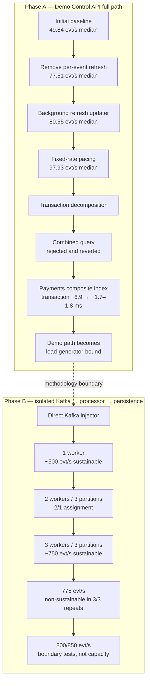

# Performance Engineering Report

This report tells the performance-engineering story from the first Demo
Control API benchmark to the measured saturation boundary of the isolated
processor pipeline. It is based on the repository's benchmark JSON, benchmark
scripts, migration, and retained decision history.

The headline numbers are deliberately split into two methodologies:

- **Phase A — Demo Control API full path:** API, scenario generation,
  manifests, progress tracking, Kafka, processor, and persistence.
- **Phase B — isolated processor pipeline:** direct Kafka injection into
  `Kafka → event_processor → Redis/business logic → PostgreSQL/outbox`.

The initial ~49.84 evt/s and final ~750 evt/s figures do not measure the same
path. This report does not claim a “49 → 750” multiplier, an 800 evt/s
achievement, or production capacity.

## From ~50 Events/s to the Saturation Boundary



### Stage 1 — Initial full-path baseline

**What did we observe?** A 100 evt/s request with 1500 events produced a
three-run median of **49.843 evt/s**. Event counts were correct. Handler p95
was **4.942 ms**, and Kafka broker timestamp to PostgreSQL `processed_at` p95
was **22.977 ms**. Those latency values did not explain a twofold generation
shortfall by themselves.

**What was the hypothesis?** The first limit was in the Demo generator rather
than Kafka or the processor. Code inspection showed this per-event sequence:

```text
Kafka publish → synchronous repository.refresh() → pacing sleep
```

`repository.refresh()` opened a synchronous PostgreSQL operation and ran
aggregate counts across manifest, processed-event, fraud-evaluation,
fraud-alert, and outbox joins on the asyncio event loop.

**What did we change/test?** No Kafka or processor change was made. The first
experiment isolated progress refresh from event generation.

**What did the next benchmark prove?** The substantial throughput increase in
Stage 2 supported the generator-blocking hypothesis. “Kafka was slow” was not
supported by this experiment.

Source: [`bench-20260802T004243Z`](../artifacts/benchmark/bench-20260802T004243Z/).

### Stage 2 — Remove progress refresh from the hot path

**What did we observe?** A synchronous progress query was running once per
event even though progress consumers only needed recent aggregate state.

**What was the hypothesis?** Removing non-essential synchronous progress work
from the generation hot path would improve throughput without changing event
or processor semantics.

**What did we change/test?** Refresh was first made periodic at approximately
500 ms with a mandatory final refresh. It was then moved to a background
updater using `asyncio.to_thread()`, coalescing multiple notifications to the
latest generated count. The updater awaited final state and handled
cancellation without leaking a task.

**What did the next benchmark prove?** The periodic-refresh run reached a
three-run median of **77.509 evt/s**; the background-refresh stage reached
**80.552 evt/s**. This supported keeping the change, but both remained below
the requested 100 evt/s.

Sources:
[`bench-after-refresh-final-20260807T114000Z`](../artifacts/benchmark/bench-after-refresh-final-20260807T114000Z/)
and [`bench-stage2-20260807T120000Z`](../artifacts/benchmark/bench-stage2-20260807T120000Z/).

**Lesson:** observability and progress code is still production code when it
runs in a hot path.

### Stage 3 — Fixed-delay pacing was not fixed-rate pacing

**What did we observe?** Low-overhead generator instrumentation reported
approximately 2 ms of work per event. The scheduler then slept for the full
10 ms interval required by 100 evt/s:

```python
do_work()
await asyncio.sleep(1 / rate)
```

The effective period was therefore approximately `2 ms + 10 ms = 12 ms`, or
`1 / 0.012 ≈ 83 evt/s`. The instrumented full-path artifact measured
**82.383 evt/s median**, matching the pacing arithmetic.

**What was the hypothesis?** Work time was being added to every interval, so
the scheduler was fixed-delay rather than fixed-rate.

**What did we change/test?** Pacing moved to monotonic deadlines:

```python
interval = 1 / rate
next_deadline += interval
await asyncio.sleep(max(0, next_deadline - loop.time()))
```

A late event did not sleep again. A long miss rebased the deadline so delayed
work could not create an unbounded catch-up burst.

**What did the next benchmark prove?** At 100 evt/s requested, the final
three-run throughput median was **97.934 evt/s**; the two steady runs were
97.934 and 98.958 evt/s, while the cold first run remained visible at 72.182
evt/s. The result supported the scheduler hypothesis without hiding warm-up
behavior.

Sources:
[`bench-instrumented-20260807T144500Z`](../artifacts/benchmark/bench-instrumented-20260807T144500Z/)
and [`bench-fixed-rate-final-20260807T151000Z`](../artifacts/benchmark/bench-fixed-rate-final-20260807T151000Z/).

**Lesson:** sleeping for `1 / rate` after work is not a fixed-rate scheduler.

### Stage 4 — First saturation sweeps

**What did we observe?** Sweeps across 100/150/200/250/300 evt/s showed
increasing Kafka lag, end-to-end latency, and PostgreSQL CPU. Around 200 evt/s,
the persisted baseline artifact reported approximately **94.534 processed
evt/s median**, **2033 peak-lag median** (2057 in one repeat), and **15.273 s
E2E p95 median**.

**What was the hypothesis?** PostgreSQL transaction work contributed to the
service-rate ceiling, but CPU utilization alone could not identify SQL,
round-trip, pool, lock, WAL, or commit cost.

**What did we change/test?** No database setting was changed. The transaction
was decomposed before selecting an optimization.

**What did the next benchmark prove?** Stage 5 isolated two payment-history
reads as the expensive SQL class. The data did not support a generic
“PostgreSQL disk is slow” conclusion.

Source:
[`bench-tx-decomposition-combined-20260808T050000Z`](../artifacts/benchmark/bench-tx-decomposition-combined-20260808T050000Z/).

### Stage 5 — Transaction decomposition

**What did we observe?** Instrumentation separated pool acquire,
`processed_events` insert/select, customer/order/session fraud context,
recent/prior payments, refunds and recent orders, fraud evaluation and alert
writes, outbox insert, commit, Redis operations, and total handler duration.
The path executed approximately **10–11 SQL statements per event**.

The detailed baseline measured recent payments at approximately
**7.16–7.26 ms average** and prior payments at approximately
**6.55–6.69 ms average**, depending on rate. Pool acquire averaged around
0.01 ms and commit around 0.31–0.36 ms in the decomposition runs.

**What was the hypothesis?** Payment-history reads, not pool contention or
durability, dominated the measured transaction cost.

**What did we change/test?** The first isolated SQL experiment reduced the two
payment-history round trips to one statement without changing transaction
boundaries.

**What did the next benchmark prove?** The combined query did not improve the
system. This rejected the simplistic “fewer statements is faster” hypothesis.

Sources:
[`bench-tx-detailed-final-20260808T070000Z`](../artifacts/benchmark/bench-tx-detailed-final-20260808T070000Z/)
and the rate-specific decomposition artifacts indexed in
[`artifacts/benchmark/README.md`](../artifacts/benchmark/README.md).

**Lesson:** resource utilization identifies pressure, not the operation that
causes it. The transaction needed decomposition before optimization.

### Stage 6 — Combined payment query: measured, rejected, reverted

**What did we observe?** Recent and prior payment-history reads accessed the
same table and looked like a candidate for round-trip consolidation.

**What was the hypothesis?** One `UNION ALL` statement would cost less than
two PostgreSQL round trips.

**What did we change/test?** The two SELECTs were temporarily combined. A
micro-level EXPLAIN looked plausible, then the unchanged 100/150/200 evt/s
steady-state benchmark was rerun.

**What did the next benchmark prove?** At 200 evt/s, medians from the retained
artifacts were:

| Metric | Original queries | Combined query |
| --- | ---: | ---: |
| Processed throughput | 94.534 evt/s | 82.600 evt/s |
| Peak lag | 2033 | 2646 |
| E2E p95 | 15.273 s | 21.457 s |
| Payment-query average | ~13.7–13.9 ms total | 14.956 ms combined |

The combined run's individual values included peak lag 2653 and combined
query averages from approximately 14.2 to 15.4 ms. System performance
regressed, so the change was reverted.

Sources:
[`bench-tx-combined-payments-20260808T080000Z`](../artifacts/benchmark/bench-tx-combined-payments-20260808T080000Z/)
and the original-query baseline above.

**Lesson:** fewer SQL round trips do not automatically produce higher
throughput. Microbenchmarks and isolated plans must be validated under
steady-state system load. A measured and reverted failure is useful evidence,
not a result to hide.

### Stage 7 — Composite-index breakthrough

**What did we observe?** The payment-history query pattern combined
`customer_id` equality, an `attempted_at` range, and descending timestamp
access. The controlled plan inspection recorded a payments `Seq Scan` with
roughly 86k rows removed by filtering.

**What was the hypothesis?** A single composite index aligned with equality,
range, and timestamp access would remove the dominant scan cost:

```sql
CREATE INDEX idx_payments_customer_attempted_at
    ON payments (customer_id, attempted_at DESC);
```

**What did we change/test?** Migration
[`005_payments_customer_attempted_at.sql`](../database/migrations/005_payments_customer_attempted_at.sql)
added only that index. The same queries and steady-state rates were measured
before and after. The recorded plans changed to `Bitmap Index Scan` plus
`Bitmap Heap Scan`.

**What did the next benchmark prove?** Controlled plan measurements recorded:

| Query | Before | After | Reduction |
| --- | ---: | ---: | ---: |
| Recent payments | 10.897 ms | 0.253 ms | ~97.7% |
| Prior payments | 7.143 ms | 0.100 ms | ~98.6% |

System-level artifacts then showed:

| Metric at 200 evt/s | Before index | After index |
| --- | ---: | ---: |
| Transaction average | ~6.9–7.5 ms | ~1.7–1.8 ms |
| Processed throughput | 94.534 evt/s median | 145.748 evt/s median in write-cost validation |
| Peak lag | 2033 median | 4 median |
| E2E p95 | 15.273 s median | 28.065 ms median in indexed read validation |
| PostgreSQL CPU | ~179% representative | ~114% representative |

The throughput and E2E figures come from two retained post-index artifacts:
the write-cost validation contains the 145.748 evt/s median, while the indexed
read sweep contains the 28.065 ms E2E median. They are not represented as one
synthetic run.

The supported causal chain is:

```text
Seq Scan → expensive fraud lookup → longer transaction → lower service rate
→ Kafka backlog → seconds-level E2E latency

Composite index → targeted lookup → shorter transaction → higher service rate
→ lag collapse → millisecond-level E2E latency
```

Sources:
[`bench-tx-index-20260808T090000Z`](../artifacts/benchmark/bench-tx-index-20260808T090000Z/)
and [`bench-tx-index-write-20260808T100000Z`](../artifacts/benchmark/bench-tx-index-write-20260808T100000Z/).

**Lesson:** query-plan-aware indexing produced the largest confirmed
optimization because both micro-level query cost and system-level queueing
improved under controlled measurement.

### Stage 8 — The Demo generator becomes the limiter

**What did we observe?** After the index, requested rates increased without
creating the processor backlog needed to measure processor saturation. The
persisted Demo-path sweep at 400 evt/s requested reports **275.597 generated
evt/s median**, **220.036 processed evt/s median**, and low peak lag. Earlier
operator notes recorded an approximately 291 generated/processed run, but no
matching JSON is present in the artifact tree; this report therefore treats
~291 as an observed upper indication, not the artifact-confirmed median.

**What was the hypothesis?** The Demo Control API generation path could no
longer feed the processor fast enough to reveal the processor ceiling.

**What did we change/test?** No application optimization was made. A
benchmark-only producer was designed to bypass Demo API, `ScenarioRunner`,
manifest writes, and progress refresh.

**What did the next benchmark prove?** Direct injection drove the processor
far beyond the Demo-path generated rate. Therefore the Demo-path limit was not
the processor ceiling.

Source:
[`bench-serial-ceiling-20260808T110000Z`](../artifacts/benchmark/bench-serial-ceiling-20260808T110000Z/).

### Stage 9 — Direct Kafka injector and methodology boundary

**What did we observe?** Processor capacity and Demo generator capacity had
become inseparable in the full path.

**What was the hypothesis?** A benchmark-only Kafka producer with valid event
schema, unique IDs, realistic distribution, and monotonic pacing could remove
the load-generator bottleneck without changing processor semantics.

**What did we change/test?** [`direct_injector.py`](../scripts/benchmark/direct_injector.py)
publishes directly to Kafka and preserves processor, Redis, business logic,
PostgreSQL, and outbox behavior. It bypasses Demo API, `ScenarioRunner`, and
manifest/progress operations.

Persisted injector artifacts show approximately:

| Requested | Actual injected |
| ---: | ---: |
| 300 | 298.3/s |
| 400 | 397.4/s |
| 500 | 496.6/s |
| 750 | 742.8/s |
| 900 | 889.4/s |

An earlier standalone capacity-validation console result recorded 975.7/s at
1000 requested, but its JSON was not retained. The repository therefore
documents **~889/s at 900 requested as the highest artifact-verifiable
injector result**, while preserving ~976/s only as a non-artifact-backed
engineering note.

**What did the next benchmark prove?** From this stage onward, measurements
describe the isolated `Kafka → processor → persistence` pipeline, not Demo
Control API full-path throughput.

### Stage 10 — Single processor ceiling

**What did we observe?** The processor has one synchronous Kafka processing
loop, and sampled max in-flight remained **1**.

**What was the hypothesis?** With adequate input, the serial processor would
reach a measurable service-rate ceiling.

**What did we change/test?** One processor was retained; only the benchmark
load source changed to direct injection.

**What did the next benchmark prove?** Approximately 500 evt/s was the last
safely demonstrated rate. Above it:

| Requested | Injected median | Processed/service median | Lag-slope repeats |
| ---: | ---: | ---: | --- |
| 600 | 592.243/s | 501.985/s | +88.9, +90.7, +101.1/s |
| 750 | 739.595/s | 560.386/s | +179.2, +199.6, +169.5/s |

The single-processor saturation transition was between 500 and 600 evt/s.

Source:
[`bench-worker-scale-1w-20260808T160000Z`](../artifacts/benchmark/bench-worker-scale-1w-20260808T160000Z/).

**Lesson:** the processor appeared limited earlier only because the Demo
generator could not feed it fast enough.

### Stage 11 — Two workers across three partitions

**What did we observe?** `commerce.events` has three partitions. Two
consumers in `commerce-event-processor-v1` received a 2/1 assignment.

**What was the hypothesis?** Horizontal consumer scaling would increase
service rate, but the uneven partition assignment could reduce efficiency.

**What did we change/test?** A second identical processor container was added;
application concurrency, topic partitions, database, Redis, and Kafka
configuration were unchanged.

**What did the next benchmark prove?** Horizontal scaling helped but was not
linear:

| Rate | 1-worker service | 2-worker service | Lag slope change |
| ---: | ---: | ---: | ---: |
| 600 | 501.985/s | 584.474/s | +90.7 → +10.4/s median |
| 750 | 560.386/s | 660.607/s | +179.2 → +80.3/s median |

The 2/1 assignment became a concrete imbalance hypothesis for Stage 12.

Source:
[`bench-worker-scale-2w-resource-20260808T180000Z`](../artifacts/benchmark/bench-worker-scale-2w-resource-20260808T180000Z/).

### Stage 12 — Three workers, three partitions

**What did we observe?** Three consumers received a verified 1/1/1 partition
assignment. At 900 evt/s, recorded worker CPU was approximately 51.7%, 50.9%,
and 52.2%, removing the visible 2/1 CPU imbalance.

**What was the hypothesis?** One consumer per partition would improve useful
parallelism and reveal the next shared ceiling.

**What did we change/test?** A third identical processor container was added;
no code, partition, query, or infrastructure setting changed.

**What did the next benchmark prove?** Three workers sustained 600 and 750
evt/s under the defined criteria:

| Requested | Injected median | Service median | Lag-slope repeats | E2E p95 median |
| ---: | ---: | ---: | --- | ---: |
| 600 | 593.923/s | 594.173/s | -12.1, +0.3, +0.6/s | 185 ms |
| 750 | 742.828/s | 742.185/s | +0.7, -10.0, +0.9/s | 954 ms |
| 900 | 889.385/s | 888.556/s | +0.8, +3.2, +1.5/s | 1.282 s |

Despite `processed ≈ injected` at 900, all three lag slopes were positive.
That rate was treated as a boundary signal, not a sustainable-capacity result.

Source:
[`bench-worker-scale-3w-20260808T191000Z`](../artifacts/benchmark/bench-worker-scale-3w-20260808T191000Z/).

### Stage 13 — Locate the actual boundary

**What did we observe?** The broad sweep placed the boundary between 750 and
900 evt/s.

**What was the hypothesis?** Longer 45-second runs at intermediate rates
would separate transient peak lag from repeatable backlog growth.

**What did we change/test?** Worker count and configuration stayed fixed at
three. Rates 800 and 850 were tested, followed by the one permitted binary-
search rate of 775 evt/s.

**What did the next benchmark prove?** 775 evt/s was non-sustainable in all
three repeats:

| Requested | Injected | Processed/service | Lag slope | E2E p95 median |
| ---: | ---: | ---: | ---: | ---: |
| 775 r0 | 765.6/s | 712.6/s | +52.9/s | — |
| 775 r1 | 765.1/s | 678.3/s | +86.8/s | — |
| 775 r2 | 765.8/s | 672.4/s | +93.4/s | — |
| 775 aggregate | 765.6/s median | 678.3/s median | +86.8/s median | 11.988 s |

800 evt/s was unstable:

| Repeat | Injected | Processed/service | Lag slope |
| ---: | ---: | ---: | ---: |
| 0 | 793.1/s | 792.2/s | +0.9/s |
| 1 | 789.9/s | 742.5/s | +47.4/s |
| 2 | 788.6/s | 788.2/s | +0.4/s |

850 evt/s was clearly non-sustainable: repeats 1 and 2 processed 554.8/s
and 652.1/s against approximately 838/s injected, with +283.3/s and +185.6/s
lag growth. Its E2E p95 median was 24.657 s.

Sources:
[`bench-worker-scale-3w-boundary-20260808T200000Z`](../artifacts/benchmark/bench-worker-scale-3w-boundary-20260808T200000Z/)
and [`bench-worker-scale-3w-boundary-775-20260808T210000Z`](../artifacts/benchmark/bench-worker-scale-3w-boundary-775-20260808T210000Z/).

**Conclusion:** the confirmed sustainable isolated capacity is approximately
**750 evt/s**, and repeatable saturation begins in the **750–775 evt/s**
transition. 775, 800, and 850 evt/s are boundary/saturation tests—not achieved
capacity.

This conclusion held for the per-event synchronous offset commit in place at
the time of Stage 13. Stage 14 below changed that commit mechanism (not the
partition/worker topology) and re-tested this boundary; see that section for
the current capacity figure.

### Stage 14 — Bounded batched offset commits move the ceiling

**What changed?** `KafkaEventConsumer.commit_terminal()` previously issued a
synchronous `commit(asynchronous=False)` Kafka round trip for every terminal
record. `services/event_processor/offset_tracker.py::OffsetCommitTracker`
replaced that with a per-partition contiguous-offset accumulator that
batches commits: flush once 50 terminal records have accumulated
(`PROCESSOR_OFFSET_COMMIT_BATCH_SIZE`) or 100ms have elapsed
(`PROCESSOR_OFFSET_COMMIT_INTERVAL_MS`), whichever comes first. The commit
call itself stayed synchronous; only its frequency changed. Full detail,
correctness invariants, and the re-test of the exact 750/775/800 boundary
rates (all three became sustainable) are in
[`optimization-history.md`](performance/optimization-history.md#bounded-batched-offset-commits--kept),
artifact
[`bench-batched-commit-3w-boundary`](../artifacts/benchmark/bench-batched-commit-3w-boundary/).

**What did the follow-up ceiling-discovery benchmark prove?** With the
topology unchanged (3 workers, 3 partitions, 1/1/1 assignment, verified
before each sweep) and only the requested rate varied, a broad sweep at
850/900/950/1000 evt/s (10s warmup, 45s steady state, 3 repeats each,
[`bench-batched-commit-3w-ceiling-broad`](../artifacts/benchmark/bench-batched-commit-3w-ceiling-broad/))
found:

| Rate | Lag slope (3 repeats) | E2E p95 (3 repeats) | Verdict |
| ---: | --- | --- | --- |
| 850 | +1.59, +1.79, +3.88/s | 73, 82, 125 ms | Sustainable |
| 900 | +1.07, +1.26, +1.77/s | 152, 136, 138 ms | Sustainable |
| 950 | +1.74, +6.22, +9.42/s | 175, 368, 343 ms | Not clearly sustainable - slope and end-of-load lag escalated across repeats |
| 1000 | +11.48, +16.27, +6.09/s | 356, 784, 548 ms | Non-sustainable - injected rate itself fell to ~99% of requested, service rate trailed injected, E2E p99 reached 1210 ms |

A refinement rate at 925 evt/s (3 repeats, same methodology,
[`bench-batched-commit-3w-ceiling-refinement`](../artifacts/benchmark/bench-batched-commit-3w-ceiling-refinement/))
produced a mixed result: lag slope stayed low and non-escalating (+2.71,
+1.28, +1.15/s, similar to 900), but E2E p95 was highly volatile and reached
1027ms and 1092ms in two of the three repeats - a regression the lag-slope
number alone does not surface. Per this report's own sustainability
criteria (lag slope, final lag, drain behavior, E2E latency behavior, and
repeat consistency considered together, not any single figure), 925 evt/s is
classified as inside the transition band, not as a new clean ceiling.

**Injector-capacity check:** at every tested rate up to 950 evt/s the
injector delivered ≥99.5% of the requested rate. At 1000 evt/s it delivered
~99%(990-993/1000), still above the project's 95% threshold, so the 1000
evt/s saturation is attributed to the processor/database path, not to the
benchmark injector falling behind.

**Correctness:** every one of the 15 repeats across both sweeps (12 broad +
3 refinement) satisfied `unique_event_ids == processed_rows == matched_e2e`
exactly - no duplicate durable side effects and no lost events at any tested
rate, including the saturated ones.

**Resource observations (measured, not inferred):** PostgreSQL container CPU
rose from ~76% at 900 evt/s to ~71-95% across the 950 evt/s repeats to
~103% at 1000 evt/s (single-sample `docker stats` snapshots; >100% reflects
more than one core). WAL full-page-image writes climbed from ~4/s at 900 to
~33/s at 950 to ~342/s at 1000 - roughly an 85x jump from 900 to 1000.
Processor worker CPU stayed moderate throughout (36-65% peak across the
three workers at the rates sampled) and never approached saturation. Kafka
broker CPU samples were low and did not trend upward with rate. This makes
**PostgreSQL the strongest evidence-based hypothesis for the next
bottleneck**, consistent with Stage 5-7's earlier finding that payment-history
reads were the dominant SQL cost before the composite index was added; this
report does not claim a proven root cause without a fresh transaction-level
measurement (that would be a new, separate experiment).

**Conclusion:** the highest artifact-backed sustainable rate increased from
approximately 750 evt/s to approximately **900 evt/s**
(`(900 - 750) / 750 × 100 ≈ 20%` capacity increase). Repeatable saturation
now begins in the **900-950 evt/s** transition (925 evt/s inside that band
showed mixed signals; 950 evt/s showed escalating lag slope across repeats;
1000 evt/s was unambiguously saturated). No code, configuration, topology,
or workload change was made during this discovery experiment - only the
requested injection rate varied.

### Stage 15 — Successful-event logging: isolated cost measurement

**What changed?** One line in `services/event_processor/processor.py`: the
per-event `event_processed` success log moved from `self._logger.info(...)`
to `self._logger.debug(...)`. Fields, the `duplicate_event_skipped` log, all
`WARNING`-level retry/DLQ logs, and startup/assignment/revocation `INFO`
logs were left unchanged. This was a pure isolation experiment - no
database, Kafka, Redis, partitioning, worker-count, batching, or producer
change accompanied it.

**What did the benchmark prove?** Same 3-worker/1/1/1 topology, same
900/925/950 evt/s rates as Stage 14, 3 repeats each, 10s warmup / 45s
steady state. A fresh `INFO` control run
([`bench-info-baseline-control-3w-boundary`](../artifacts/benchmark/bench-info-baseline-control-3w-boundary/))
preceded a `DEBUG` experiment run
([`bench-debug-success-log-3w-boundary`](../artifacts/benchmark/bench-debug-success-log-3w-boundary/))
on a rebuilt image with freshly recreated containers, so `docker logs
--since/--until` gave a clean, time-windowed stdout/stderr comparison:

| Metric | INFO | DEBUG |
| --- | ---: | ---: |
| `event_processed` lines (measured window) | 456,181 | 0 |
| stdout+stderr bytes (3 workers, measured window) | ~254.1 MB | ~7.0 KB |
| Mean processor CPU | ~53.4% | ~51.5% |
| Handler p95 | 4.87-4.89 ms | 4.75-4.94 ms |
| PostgreSQL CPU (mean of peak samples) | ~76% | ~82% (noisy, one 117.6% outlier) |
| Correctness | held in all 9 repeats | held in all 9 repeats |

Full detail, including why the ~2-point CPU delta and the noisy lag-slope/
E2E-latency figures in both conditions are judged not to be a systematic
effect of the log-level change, is in
[`optimization-history.md`](performance/optimization-history.md#successful-event-log-moved-to-debug--kept-operational-not-a-throughput-win).

**Conclusion:** negligible-to-marginal performance effect (Outcome C).
Stdout volume dropped essentially to zero for this log line - a real
operational win - but processor CPU, handler latency, PostgreSQL CPU/
latency, and the 900/925/950 sustainability classification did not
materially change. **Kept anyway**, because Prometheus already provides
equivalent successful-event observability and the same diagnostic remains
available on demand at `PROCESSOR_LOG_LEVEL=DEBUG`. This result strengthens
the PostgreSQL bottleneck hypothesis by elimination: removing the per-event
log did not move PostgreSQL's numbers at all, so Stage 14's Postgres CPU/WAL
evidence is not an artifact of processor-side logging.

### Stage 16 — Transaction decomposition v2: diagnosis, not optimization

**What changed?** Nothing in application code. This stage answers which part
of the already-instrumented transaction grows expensive near the 900-950
evt/s boundary, using the transaction/SQL-class instrumentation already
active from the original Stage 5 decomposition (`InstrumentedConnection`,
`database_stage_duration_seconds`, `database_sql_duration_seconds`) read
through Prometheus, plus new read-only `pg_stat_user_tables`/`pg_stat_wal`/
`pg_stat_checkpointer`/`pg_locks` snapshots added only to the benchmark
tooling (`scripts/benchmark/saturation.py`, `direct_saturation.py`). No SQL,
index, schema, Kafka, Redis, worker/partition, offset-batching, logging,
pool, PostgreSQL, or fraud-rule configuration was touched.

**What did the benchmark prove?** Same 3-worker/1/1/1 topology, same 900/925/
950 evt/s x 3 repeats as Stage 14/15
([`bench-tx-decomposition-v2-3w-boundary`](../artifacts/benchmark/bench-tx-decomposition-v2-3w-boundary/)).

| Stage | Avg (ms, mean of 9 repeats) | Share of transaction total |
| --- | ---: | ---: |
| `fraud_context` (10 SELECTs) | 1.055 | ~46% at 900 evt/s, ~59% at 950 evt/s |
| `business_persistence` | 0.443 | ~21% |
| `fraud_persistence` | 0.411 | ~19% |
| `commit` | 0.333 | ~16% |
| `processed_events_insert` | 0.151 | ~7% |
| `pool_acquire` + `connection_release` | 0.031 combined | <2% |

`EXPLAIN (ANALYZE, BUFFERS)` on the fraud-context queries proved
`fraud_context_recent_orders` and `fraud_context_product_views` run as
`Filter`-based Bitmap Heap Scans (no composite index, unlike `payments`),
costing 4-20x the composite-indexed lookups in the same stage against a
representative customer. `pg_stat_user_tables` showed zero sequential scans
and >97.5% buffer hit ratio at every rate across all 9 repeats, ruling out
scan regression and cache eviction. `pool_acquire`/`connection_release`
(≤0.018 ms / ≤0.013 ms mean) and `fraud_evaluation_cpu` (≤0.09 ms mean, pure
Python) stayed negligible at every rate, ruling out pool contention and
fraud-rule CPU as bottlenecks. Fraud-eligible event types cost 2-5x more
handler time than non-fraud types in every repeat. WAL FPI rate swung
83.9-786.4/s with no clean correlation to rate, consistent with checkpoint
timing rather than transaction volume. This sweep's lag-slope/E2E-p95 range
(+1.37 to +42.27 evt/s; 385-4057 ms) was wider than Stage 15's equivalent
sweep, attributed to hours of accumulated benchmark data volume against a
finite reused customer pool interacting with the missing-index finding
above, not to the (zero new application code) instrumentation itself. Full
detail, the complete SQL-class table, and the ranked next-experiment list
are in
[`optimization-history.md`](performance/optimization-history.md#transaction-decomposition-v2--diagnosis-only-no-change-made).

**Conclusion:** **Proven** — `fraud_context` is the largest single
database-side cost in a fraud-eligible transaction and its share grows
toward saturation; the `orders`/`product_views` composite-index gap is an
EXPLAIN-proven, evidence-backed candidate root cause within that stage.
**Ruled out** — connection pool contention, fraud rule evaluation CPU,
sequential-scan regression, buffer-cache eviction. **Not implemented in this
stage** — per its explicit "diagnosis before optimization" scope, no index
was added; that is the top-ranked next experiment, ideally preceded by a
reset-and-rerun control sweep to separate the data-volume confound from the
rate-driven signal.

### Stage 17 — Orders composite index: A/B experiment

**What changed?** One migration,
[`006_orders_customer_ordered_at.sql`](../database/migrations/006_orders_customer_ordered_at.sql):
`CREATE INDEX idx_orders_customer_ordered_at ON orders (customer_id,
ordered_at DESC)`. This targets the exact hot query Stage 16 identified -
`FraudContext`'s bounded recent-orders count, which was running as a
`customer_id`-only `Bitmap Heap Scan` with the date range applied as a
`Filter`. Column order mirrors the existing `payments` composite index
(equality column, then the range/sort column in its own sort direction). No
other index, query, schema, Kafka, Redis, worker/partition, pool, or
logging change accompanied it.

**Controlled A/B methodology.** The live database had accumulated 2.5M+
`processed_events` rows across the session's prior benchmarking - a direct
confound for a clean before/after. Both sweeps ran from an identically
reset, truncated schema (`scripts/reset-benchmark-data.sql`): baseline
first (migration file not yet on disk, so it could not be applied), then a
second truncate, then the migration added and applied, then the indexed
sweep - same 3-worker/1/1/1 topology, same 900/925/950 evt/s × 3 repeats,
same 10s/45s timing
([`bench-orders-index-baseline-3w-boundary`](../artifacts/benchmark/bench-orders-index-baseline-3w-boundary/),
[`bench-orders-index-3w-boundary`](../artifacts/benchmark/bench-orders-index-3w-boundary/)).

**EXPLAIN evidence** (comparable representative customers, ~85-90 orders
each): baseline - `Bitmap Heap Scan` + `Filter` + `Sort`, 39 buffer hits,
0.195 ms. Indexed - `Index Only Scan`, `Heap Fetches: 0`, no sort, 5 buffer
hits, 0.073 ms. ~2.7x faster, ~7.8x fewer buffers, heap access and sort
both eliminated.

| Rate | Lag slope (base → idx) | E2E p95 ms (base → idx) | PostgreSQL CPU (base → idx) |
| --- | --- | --- | --- |
| 900 | +3.06 → +1.48/s | 230 → 120 | 57.8% → 56.2% |
| 925 | +1.83 → +1.24/s | 140 → 98 | 62.1% → 60.0% |
| 950 | +1.84 → +1.25/s | 246 → 181 | 71.7% → 77.2% |

Lag slope and E2E p95 both improved consistently at every rate. PostgreSQL
CPU and processor CPU showed no consistent change. Transaction-total/
`fraud_context` histogram averages were noisy at their sub-2ms scale with 3
repeats and did not show a clean trend - the EXPLAIN evidence, not the
stage histograms, is the reliable signal for the query-level effect here.
Write-cost check (`ORDER_CREATED` handler latency, `business_persistence`,
orders insert counts, WAL records/s) showed no consistent regression. Full
detail in
[`optimization-history.md`](performance/optimization-history.md#orders-composite-index--kept).

**Conclusion: kept (Outcome A).** Query plan improved and a consistent
system-level improvement (lower lag slope, lower E2E p95) followed at every
measured rate, with no measurable write-cost or PostgreSQL-CPU regression.
At 950 evt/s specifically, all three indexed repeats were clean and
materially better than the already-cleaner fresh baseline - the index
materially improved behavior at the previous transition boundary, though
this does not establish a new sustainable ceiling above 950 evt/s (that
would need a separate ceiling-discovery sweep). Correctness held in all 18
repeats; all four processor smoke scenarios passed against the post-index
schema.

### Stage 18 — Product-views composite index: A/B experiment

**What changed?** One migration,
[`007_product_views_customer_viewed_at.sql`](../database/migrations/007_product_views_customer_viewed_at.sql):
`CREATE INDEX idx_product_views_customer_viewed_at ON product_views
(customer_id, viewed_at DESC)`. Targets the same-shaped hot query Stage 16
flagged - `FraudContext`'s bounded recent-product-view count, previously a
`customer_id`-only `Bitmap Heap Scan` with the date range as a `Filter`.
Mirrors the Stage 17 `orders`-index methodology exactly: same reset
procedure, same topology, same rates/timing, `orders`/`payments` indexes
and all other configuration untouched.

**EXPLAIN evidence** (comparable representative customers, ~175-177 product
views each, from an identically-reset, apples-to-apples dataset): baseline
- `Bitmap Heap Scan` + `Filter` + `Sort`, 60 buffer hits, 0.613 ms. Indexed
- `Index Only Scan`, `Heap Fetches: 0`, no sort, 5 buffers, 0.172 ms. ~3.6x
faster, ~12x fewer buffers - a larger relative and absolute EXPLAIN
improvement than the `orders` index (2.7x / 39→5 buffers), reflecting this
table's larger per-customer view counts.

| Rate | Lag slope (base→idx) | E2E p95 ms (base→idx) | fraud_context ms (base→idx) |
| --- | --- | --- | --- |
| 900 | +3.06→+1.20/s (‑61%) | 263→113 (‑57%) | 1.03→0.87 (‑15%) |
| 925 | +1.59→+1.37/s (‑14%) | 132→132 (flat) | 0.82→0.86 (+5%) |
| 950 | +2.33→+1.84/s (‑21%) | 139→163 (+17%, noise-dominated) | 1.12→0.86 (‑24%) |

900 evt/s shows a clear, consistent win, similar in shape to Stage 17's
result. 925 evt/s is a wash. 950 evt/s is noise-dominated - lag slope and
peak lag improved in aggregate, but mean E2E p95 was pulled up by one
unusually clean baseline repeat; `product_views` insert counts, handler
latency, and WAL records/s all stayed flat or improved at 950, which is
inconsistent with a genuine regression. No rate showed a measurable
write-cost or WAL regression (insert counts ±1%, WAL records/s ±2% at every
rate). Full detail in
[`optimization-history.md`](performance/optimization-history.md#product-views-composite-index--kept).

**Comparison with the `orders` index (Stage 17):** `product_views` produced
the *larger* EXPLAIN improvement (3.6x vs 2.7x execution time; 12x vs 7.8x
fewer buffers). `orders` produced the *larger* system-level improvement -
it improved lag slope and E2E p95 consistently at all three rates, while
`product_views` only showed a clean win at 900 evt/s. Neither index showed
a measurable write/WAL maintenance cost. After both indexes, `fraud_context`
still spans ~8 further lookups (customer/session/order single-row
lookups plus the already-indexed payments/refunds queries); Stage 16's
SQL-class breakdown showed no single remaining query dominating that
residual cost.

**Conclusion: kept.** Query plan improved substantially (EXPLAIN-proven)
with no measurable write-cost or PostgreSQL-CPU regression at any rate;
900 evt/s showed a clear system-level win (Outcome A), while 925/950 evt/s
showed no clear win but also no regression (Outcome B, neutral). No
boundary-improvement claim is made at 950 evt/s for this index
specifically - unlike Stage 17, not all three indexed 950 repeats were
unambiguously cleaner than baseline. Correctness held in all 18 repeats;
all four processor smoke scenarios passed against the post-index schema.

### Stage 19 — Post-index capacity discovery: measurement only

**Why?** With both the `orders` and `product_views` composite indexes
retained, the previous ~900/925/950 boundary (established before either
index existed) was stale. This stage locates the actual boundary under the
current configuration - no code, SQL, index, or configuration change of any
kind.

**Clean state.** `scripts/reset-benchmark-data.sql` run once before the
sweep; all benchmark tables confirmed at 0 rows; schema verified at
migration version 7 with all three composite indexes present; 3 workers,
1/1/1 assignment, lag 0 confirmed before starting.

**Broad sweep** (950/1000/1050/1100 evt/s × 3, 10s warmup, 45s steady; tag
[`bench-post-index-3w-ceiling-broad`](../artifacts/benchmark/bench-post-index-3w-ceiling-broad/)):

| Rate | Repeats clean | Lag slope range | E2E p95 range | Peak PG CPU |
| --- | --- | --- | --- | --- |
| 950 | 2/3 | +2.0 to +19.3/s | 129-1743ms | 110% |
| 1000 | 3/3 | +0.7 to +1.7/s | 145-283ms | 77% |
| 1050 | 3/3 | +1.1 to +2.5/s | 152-583ms | 100% |
| 1100 | 1/3 | +1.8 to +24.9/s | 439-2474ms | 132% |

The injector kept pace at 99.4-99.9% of requested rate at every repeat
through 1100 evt/s - the degradation above 1000 is genuine
processor/PostgreSQL saturation, not an injector artifact.

**Refinement** (1075 evt/s × 3; tag
[`bench-post-index-3w-ceiling-refinement`](../artifacts/benchmark/bench-post-index-3w-ceiling-refinement/)):
slope +10.0/+3.0/+34.8/s, E2E p95 407/552/2275ms - 2 of 3 repeats degraded,
the same non-sustainable pattern as 1100.

**Boundary: highest clearly sustainable = 1050 evt/s (all 3 repeats
bounded); first repeatably non-sustainable = 1075 evt/s (2/3 degraded).
Transition interval ~1050-1075 evt/s** (25 evt/s, within the acceptable
range - no further refinement performed).

**Resource trend.** PostgreSQL CPU rose most sharply and most
monotonically across the sweep (mean/max: 75%/110% → 64%/77% → 81%/100% →
110%/132% at 950/1000/1050/1100). Processor CPU also rose but stayed well
under its ceiling. Per-transaction cost (`transaction_total`,
`fraud_context`) stayed flat across all four rates (~1.5-1.6ms /
~0.82-0.85ms) - the marginal transaction isn't more expensive at higher
rates; there are simply more of them contending for the same PostgreSQL
capacity. **Hypothesis (not proven here): PostgreSQL CPU is the most
likely next bottleneck.**

**Correctness** held in all 15 repeats (12 broad + 3 refinement); all four
processor smoke scenarios passed. Full detail in
[`optimization-history.md`](performance/optimization-history.md#post-index-capacity-discovery--measurement-only-no-code-change).

**Capacity comparison** (kept causally distinct, not attributed to a
single change): vs. the post-batching boundary (~900 evt/s):
`(1050-900)/900 = +16.7%`. vs. the pre-batched-commit boundary (~750
evt/s): `(1050-750)/750 = +40.0%`. Batched offset commits moved the
boundary ~750→900 (Stage 14); the two composite indexes were then followed
by this fresh sweep, which establishes the new ~1000-1050 evt/s boundary -
the two indexes are not solely credited with the full 750→1050 change.

**No implementation changes were made.** Environment restored to 1 worker,
lag 0.

## Final Capacity Summary

| Path/configuration | Artifact-backed result | Meaning |
| --- | ---: | --- |
| Initial Demo full path | 49.843 evt/s median | 100 evt/s request before hot-path fixes |
| Demo full path after pacing | 97.934 evt/s median | 100 evt/s request after fixed-rate pacing |
| Demo high-rate controlled sweep | 275.597 generated/s median at 400 requested | Persisted generator-bound sweep; ~291 was noted elsewhere but not retained as JSON |
| Direct injector | 889.385/s median at 900 requested | Highest persisted injector rate; 975.7/s at 1000 was not retained as JSON |
| One processor | ~500 evt/s sustainable | Isolated pipeline, max in-flight 1 |
| Two processors | ~500 evt/s safely confirmed; 600 boundary | Three partitions assigned 2/1 |
| Three processors (per-event commit) | ~750 evt/s sustainable | Three partitions assigned 1/1/1; superseded by the row below |
| Three-processor transition (per-event commit) | 750–775 evt/s | 775 failed all three sustainability repeats |
| Three processors (batched offset commit) | ~900 evt/s sustainable | Same 1/1/1 topology; only the commit mechanism changed (Stage 14) |
| Three-processor transition (batched offset commit) | 900–950 evt/s | 925 mixed/marginal; 950 showed escalating lag slope across repeats; 1000 unambiguously saturated |
| Three processors (after `orders` + `product_views` composite indexes) | ~1000-1050 evt/s sustainable | Same 1/1/1 topology; fresh clean-state sweep after Stage 17/18 (Stage 19) |
| Three-processor transition (after both indexes) | 1050–1075 evt/s | 1075 showed 2/3 degraded repeats; 1100 confirmed non-sustainable (1/3 clean) |

## Engineering Lessons

1. Measure before scaling; the first bottleneck was not where CPU pressure
   initially suggested.
2. Observability and progress work can become part of a hot path.
3. Fixed-delay pacing is not fixed-rate pacing.
4. High PostgreSQL CPU did not prove fsync or commit was the bottleneck.
5. Transaction decomposition identified the expensive payment-history reads.
6. Fewer SQL round trips did not guarantee higher throughput.
7. Query-plan-aware indexing produced the largest confirmed optimization.
8. Load-generator capacity must exceed system-under-test capacity.
9. Kafka worker scaling is constrained by partition topology.
10. Sustainable throughput requires bounded lag, not merely high processed/s.
11. Failed experiments are useful evidence when measured and reverted.

## Environment, reliability, and limitations

The measurements used the documented local arm64 Mac/Docker Desktop
environment: an 8-CPU Docker VM, one Kafka broker, PostgreSQL 17.5, Redis
7.4.5, and the repository's mixed-traffic workload. Compose configured no CPU
quota. These observations do not establish production capacity or a general
Kafka/PostgreSQL limit.

Prometheus scrape and runtime-sampling resolution constrain peak/resource
interpretation. Aggregate processor metrics did not expose a worker label for
per-worker processed counts, so the report does not invent those values.

Reliability evidence remains preserved in
[`bench-fixed-rate-final-20260807T151000Z`](../artifacts/benchmark/bench-fixed-rate-final-20260807T151000Z/):
zero duplicate durable side effects, controlled retry/DLQ checks, and 100%
outbox publish success for the defined scenarios. The disruptive outage test
was not run.

See [methodology](performance/methodology.md),
[optimization history](performance/optimization-history.md),
[scaling analysis](performance/scaling-analysis.md), and the
[artifact index](../artifacts/benchmark/README.md).
