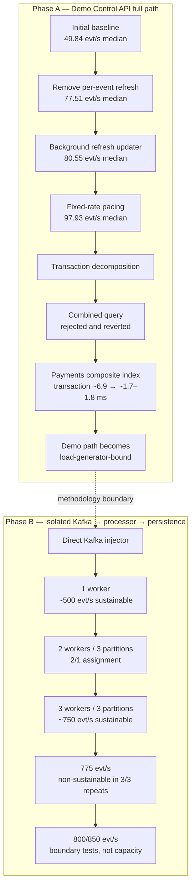

# Performance Engineering Report

This report tells the performance-engineering story from the first Demo
Control API benchmark to the measured saturation boundary of the isolated
processor pipeline. It is based on the repository's benchmark JSON, benchmark
scripts, migration, and retained decision history.

The headline numbers are deliberately split into two methodologies:

- **Phase A — Demo Control API full path:** API, scenario generation,
  manifests, progress tracking, Kafka, processor, and persistence.
- **Phase B — isolated processor pipeline:** direct Kafka injection into
  `Kafka → event_processor → Redis/business logic → PostgreSQL/outbox`.

The initial ~49.84 evt/s and final ~750 evt/s figures do not measure the same
path. This report does not claim a “49 → 750” multiplier, an 800 evt/s
achievement, or production capacity.

## From ~50 Events/s to the Saturation Boundary



### Stage 1 — Initial full-path baseline

**What did we observe?** A 100 evt/s request with 1500 events produced a
three-run median of **49.843 evt/s**. Event counts were correct. Handler p95
was **4.942 ms**, and Kafka broker timestamp to PostgreSQL `processed_at` p95
was **22.977 ms**. Those latency values did not explain a twofold generation
shortfall by themselves.

**What was the hypothesis?** The first limit was in the Demo generator rather
than Kafka or the processor. Code inspection showed this per-event sequence:

```text
Kafka publish → synchronous repository.refresh() → pacing sleep
```

`repository.refresh()` opened a synchronous PostgreSQL operation and ran
aggregate counts across manifest, processed-event, fraud-evaluation,
fraud-alert, and outbox joins on the asyncio event loop.

**What did we change/test?** No Kafka or processor change was made. The first
experiment isolated progress refresh from event generation.

**What did the next benchmark prove?** The substantial throughput increase in
Stage 2 supported the generator-blocking hypothesis. “Kafka was slow” was not
supported by this experiment.

Source: [`bench-20260802T004243Z`](../artifacts/benchmark/bench-20260802T004243Z/).

### Stage 2 — Remove progress refresh from the hot path

**What did we observe?** A synchronous progress query was running once per
event even though progress consumers only needed recent aggregate state.

**What was the hypothesis?** Removing non-essential synchronous progress work
from the generation hot path would improve throughput without changing event
or processor semantics.

**What did we change/test?** Refresh was first made periodic at approximately
500 ms with a mandatory final refresh. It was then moved to a background
updater using `asyncio.to_thread()`, coalescing multiple notifications to the
latest generated count. The updater awaited final state and handled
cancellation without leaking a task.

**What did the next benchmark prove?** The periodic-refresh run reached a
three-run median of **77.509 evt/s**; the background-refresh stage reached
**80.552 evt/s**. This supported keeping the change, but both remained below
the requested 100 evt/s.

Sources:
[`bench-after-refresh-final-20260807T114000Z`](../artifacts/benchmark/bench-after-refresh-final-20260807T114000Z/)
and [`bench-stage2-20260807T120000Z`](../artifacts/benchmark/bench-stage2-20260807T120000Z/).

**Lesson:** observability and progress code is still production code when it
runs in a hot path.

### Stage 3 — Fixed-delay pacing was not fixed-rate pacing

**What did we observe?** Low-overhead generator instrumentation reported
approximately 2 ms of work per event. The scheduler then slept for the full
10 ms interval required by 100 evt/s:

```python
do_work()
await asyncio.sleep(1 / rate)
```

The effective period was therefore approximately `2 ms + 10 ms = 12 ms`, or
`1 / 0.012 ≈ 83 evt/s`. The instrumented full-path artifact measured
**82.383 evt/s median**, matching the pacing arithmetic.

**What was the hypothesis?** Work time was being added to every interval, so
the scheduler was fixed-delay rather than fixed-rate.

**What did we change/test?** Pacing moved to monotonic deadlines:

```python
interval = 1 / rate
next_deadline += interval
await asyncio.sleep(max(0, next_deadline - loop.time()))
```

A late event did not sleep again. A long miss rebased the deadline so delayed
work could not create an unbounded catch-up burst.

**What did the next benchmark prove?** At 100 evt/s requested, the final
three-run throughput median was **97.934 evt/s**; the two steady runs were
97.934 and 98.958 evt/s, while the cold first run remained visible at 72.182
evt/s. The result supported the scheduler hypothesis without hiding warm-up
behavior.

Sources:
[`bench-instrumented-20260807T144500Z`](../artifacts/benchmark/bench-instrumented-20260807T144500Z/)
and [`bench-fixed-rate-final-20260807T151000Z`](../artifacts/benchmark/bench-fixed-rate-final-20260807T151000Z/).

**Lesson:** sleeping for `1 / rate` after work is not a fixed-rate scheduler.

### Stage 4 — First saturation sweeps

**What did we observe?** Sweeps across 100/150/200/250/300 evt/s showed
increasing Kafka lag, end-to-end latency, and PostgreSQL CPU. Around 200 evt/s,
the persisted baseline artifact reported approximately **94.534 processed
evt/s median**, **2033 peak-lag median** (2057 in one repeat), and **15.273 s
E2E p95 median**.

**What was the hypothesis?** PostgreSQL transaction work contributed to the
service-rate ceiling, but CPU utilization alone could not identify SQL,
round-trip, pool, lock, WAL, or commit cost.

**What did we change/test?** No database setting was changed. The transaction
was decomposed before selecting an optimization.

**What did the next benchmark prove?** Stage 5 isolated two payment-history
reads as the expensive SQL class. The data did not support a generic
“PostgreSQL disk is slow” conclusion.

Source:
[`bench-tx-decomposition-combined-20260808T050000Z`](../artifacts/benchmark/bench-tx-decomposition-combined-20260808T050000Z/).

### Stage 5 — Transaction decomposition

**What did we observe?** Instrumentation separated pool acquire,
`processed_events` insert/select, customer/order/session fraud context,
recent/prior payments, refunds and recent orders, fraud evaluation and alert
writes, outbox insert, commit, Redis operations, and total handler duration.
The path executed approximately **10–11 SQL statements per event**.

The detailed baseline measured recent payments at approximately
**7.16–7.26 ms average** and prior payments at approximately
**6.55–6.69 ms average**, depending on rate. Pool acquire averaged around
0.01 ms and commit around 0.31–0.36 ms in the decomposition runs.

**What was the hypothesis?** Payment-history reads, not pool contention or
durability, dominated the measured transaction cost.

**What did we change/test?** The first isolated SQL experiment reduced the two
payment-history round trips to one statement without changing transaction
boundaries.

**What did the next benchmark prove?** The combined query did not improve the
system. This rejected the simplistic “fewer statements is faster” hypothesis.

Sources:
[`bench-tx-detailed-final-20260808T070000Z`](../artifacts/benchmark/bench-tx-detailed-final-20260808T070000Z/)
and the rate-specific decomposition artifacts indexed in
[`artifacts/benchmark/README.md`](../artifacts/benchmark/README.md).

**Lesson:** resource utilization identifies pressure, not the operation that
causes it. The transaction needed decomposition before optimization.

### Stage 6 — Combined payment query: measured, rejected, reverted

**What did we observe?** Recent and prior payment-history reads accessed the
same table and looked like a candidate for round-trip consolidation.

**What was the hypothesis?** One `UNION ALL` statement would cost less than
two PostgreSQL round trips.

**What did we change/test?** The two SELECTs were temporarily combined. A
micro-level EXPLAIN looked plausible, then the unchanged 100/150/200 evt/s
steady-state benchmark was rerun.

**What did the next benchmark prove?** At 200 evt/s, medians from the retained
artifacts were:

| Metric | Original queries | Combined query |
| --- | ---: | ---: |
| Processed throughput | 94.534 evt/s | 82.600 evt/s |
| Peak lag | 2033 | 2646 |
| E2E p95 | 15.273 s | 21.457 s |
| Payment-query average | ~13.7–13.9 ms total | 14.956 ms combined |

The combined run's individual values included peak lag 2653 and combined
query averages from approximately 14.2 to 15.4 ms. System performance
regressed, so the change was reverted.

Sources:
[`bench-tx-combined-payments-20260808T080000Z`](../artifacts/benchmark/bench-tx-combined-payments-20260808T080000Z/)
and the original-query baseline above.

**Lesson:** fewer SQL round trips do not automatically produce higher
throughput. Microbenchmarks and isolated plans must be validated under
steady-state system load. A measured and reverted failure is useful evidence,
not a result to hide.

### Stage 7 — Composite-index breakthrough

**What did we observe?** The payment-history query pattern combined
`customer_id` equality, an `attempted_at` range, and descending timestamp
access. The controlled plan inspection recorded a payments `Seq Scan` with
roughly 86k rows removed by filtering.

**What was the hypothesis?** A single composite index aligned with equality,
range, and timestamp access would remove the dominant scan cost:

```sql
CREATE INDEX idx_payments_customer_attempted_at
    ON payments (customer_id, attempted_at DESC);
```

**What did we change/test?** Migration
[`005_payments_customer_attempted_at.sql`](../database/migrations/005_payments_customer_attempted_at.sql)
added only that index. The same queries and steady-state rates were measured
before and after. The recorded plans changed to `Bitmap Index Scan` plus
`Bitmap Heap Scan`.

**What did the next benchmark prove?** Controlled plan measurements recorded:

| Query | Before | After | Reduction |
| --- | ---: | ---: | ---: |
| Recent payments | 10.897 ms | 0.253 ms | ~97.7% |
| Prior payments | 7.143 ms | 0.100 ms | ~98.6% |

System-level artifacts then showed:

| Metric at 200 evt/s | Before index | After index |
| --- | ---: | ---: |
| Transaction average | ~6.9–7.5 ms | ~1.7–1.8 ms |
| Processed throughput | 94.534 evt/s median | 145.748 evt/s median in write-cost validation |
| Peak lag | 2033 median | 4 median |
| E2E p95 | 15.273 s median | 28.065 ms median in indexed read validation |
| PostgreSQL CPU | ~179% representative | ~114% representative |

The throughput and E2E figures come from two retained post-index artifacts:
the write-cost validation contains the 145.748 evt/s median, while the indexed
read sweep contains the 28.065 ms E2E median. They are not represented as one
synthetic run.

The supported causal chain is:

```text
Seq Scan → expensive fraud lookup → longer transaction → lower service rate
→ Kafka backlog → seconds-level E2E latency

Composite index → targeted lookup → shorter transaction → higher service rate
→ lag collapse → millisecond-level E2E latency
```

Sources:
[`bench-tx-index-20260808T090000Z`](../artifacts/benchmark/bench-tx-index-20260808T090000Z/)
and [`bench-tx-index-write-20260808T100000Z`](../artifacts/benchmark/bench-tx-index-write-20260808T100000Z/).

**Lesson:** query-plan-aware indexing produced the largest confirmed
optimization because both micro-level query cost and system-level queueing
improved under controlled measurement.

### Stage 8 — The Demo generator becomes the limiter

**What did we observe?** After the index, requested rates increased without
creating the processor backlog needed to measure processor saturation. The
persisted Demo-path sweep at 400 evt/s requested reports **275.597 generated
evt/s median**, **220.036 processed evt/s median**, and low peak lag. Earlier
operator notes recorded an approximately 291 generated/processed run, but no
matching JSON is present in the artifact tree; this report therefore treats
~291 as an observed upper indication, not the artifact-confirmed median.

**What was the hypothesis?** The Demo Control API generation path could no
longer feed the processor fast enough to reveal the processor ceiling.

**What did we change/test?** No application optimization was made. A
benchmark-only producer was designed to bypass Demo API, `ScenarioRunner`,
manifest writes, and progress refresh.

**What did the next benchmark prove?** Direct injection drove the processor
far beyond the Demo-path generated rate. Therefore the Demo-path limit was not
the processor ceiling.

Source:
[`bench-serial-ceiling-20260808T110000Z`](../artifacts/benchmark/bench-serial-ceiling-20260808T110000Z/).

### Stage 9 — Direct Kafka injector and methodology boundary

**What did we observe?** Processor capacity and Demo generator capacity had
become inseparable in the full path.

**What was the hypothesis?** A benchmark-only Kafka producer with valid event
schema, unique IDs, realistic distribution, and monotonic pacing could remove
the load-generator bottleneck without changing processor semantics.

**What did we change/test?** [`direct_injector.py`](../scripts/benchmark/direct_injector.py)
publishes directly to Kafka and preserves processor, Redis, business logic,
PostgreSQL, and outbox behavior. It bypasses Demo API, `ScenarioRunner`, and
manifest/progress operations.

Persisted injector artifacts show approximately:

| Requested | Actual injected |
| ---: | ---: |
| 300 | 298.3/s |
| 400 | 397.4/s |
| 500 | 496.6/s |
| 750 | 742.8/s |
| 900 | 889.4/s |

An earlier standalone capacity-validation console result recorded 975.7/s at
1000 requested, but its JSON was not retained. The repository therefore
documents **~889/s at 900 requested as the highest artifact-verifiable
injector result**, while preserving ~976/s only as a non-artifact-backed
engineering note.

**What did the next benchmark prove?** From this stage onward, measurements
describe the isolated `Kafka → processor → persistence` pipeline, not Demo
Control API full-path throughput.

### Stage 10 — Single processor ceiling

**What did we observe?** The processor has one synchronous Kafka processing
loop, and sampled max in-flight remained **1**.

**What was the hypothesis?** With adequate input, the serial processor would
reach a measurable service-rate ceiling.

**What did we change/test?** One processor was retained; only the benchmark
load source changed to direct injection.

**What did the next benchmark prove?** Approximately 500 evt/s was the last
safely demonstrated rate. Above it:

| Requested | Injected median | Processed/service median | Lag-slope repeats |
| ---: | ---: | ---: | --- |
| 600 | 592.243/s | 501.985/s | +88.9, +90.7, +101.1/s |
| 750 | 739.595/s | 560.386/s | +179.2, +199.6, +169.5/s |

The single-processor saturation transition was between 500 and 600 evt/s.

Source:
[`bench-worker-scale-1w-20260808T160000Z`](../artifacts/benchmark/bench-worker-scale-1w-20260808T160000Z/).

**Lesson:** the processor appeared limited earlier only because the Demo
generator could not feed it fast enough.

### Stage 11 — Two workers across three partitions

**What did we observe?** `commerce.events` has three partitions. Two
consumers in `commerce-event-processor-v1` received a 2/1 assignment.

**What was the hypothesis?** Horizontal consumer scaling would increase
service rate, but the uneven partition assignment could reduce efficiency.

**What did we change/test?** A second identical processor container was added;
application concurrency, topic partitions, database, Redis, and Kafka
configuration were unchanged.

**What did the next benchmark prove?** Horizontal scaling helped but was not
linear:

| Rate | 1-worker service | 2-worker service | Lag slope change |
| ---: | ---: | ---: | ---: |
| 600 | 501.985/s | 584.474/s | +90.7 → +10.4/s median |
| 750 | 560.386/s | 660.607/s | +179.2 → +80.3/s median |

The 2/1 assignment became a concrete imbalance hypothesis for Stage 12.

Source:
[`bench-worker-scale-2w-resource-20260808T180000Z`](../artifacts/benchmark/bench-worker-scale-2w-resource-20260808T180000Z/).

### Stage 12 — Three workers, three partitions

**What did we observe?** Three consumers received a verified 1/1/1 partition
assignment. At 900 evt/s, recorded worker CPU was approximately 51.7%, 50.9%,
and 52.2%, removing the visible 2/1 CPU imbalance.

**What was the hypothesis?** One consumer per partition would improve useful
parallelism and reveal the next shared ceiling.

**What did we change/test?** A third identical processor container was added;
no code, partition, query, or infrastructure setting changed.

**What did the next benchmark prove?** Three workers sustained 600 and 750
evt/s under the defined criteria:

| Requested | Injected median | Service median | Lag-slope repeats | E2E p95 median |
| ---: | ---: | ---: | --- | ---: |
| 600 | 593.923/s | 594.173/s | -12.1, +0.3, +0.6/s | 185 ms |
| 750 | 742.828/s | 742.185/s | +0.7, -10.0, +0.9/s | 954 ms |
| 900 | 889.385/s | 888.556/s | +0.8, +3.2, +1.5/s | 1.282 s |

Despite `processed ≈ injected` at 900, all three lag slopes were positive.
That rate was treated as a boundary signal, not a sustainable-capacity result.

Source:
[`bench-worker-scale-3w-20260808T191000Z`](../artifacts/benchmark/bench-worker-scale-3w-20260808T191000Z/).

### Stage 13 — Locate the actual boundary

**What did we observe?** The broad sweep placed the boundary between 750 and
900 evt/s.

**What was the hypothesis?** Longer 45-second runs at intermediate rates
would separate transient peak lag from repeatable backlog growth.

**What did we change/test?** Worker count and configuration stayed fixed at
three. Rates 800 and 850 were tested, followed by the one permitted binary-
search rate of 775 evt/s.

**What did the next benchmark prove?** 775 evt/s was non-sustainable in all
three repeats:

| Requested | Injected | Processed/service | Lag slope | E2E p95 median |
| ---: | ---: | ---: | ---: | ---: |
| 775 r0 | 765.6/s | 712.6/s | +52.9/s | — |
| 775 r1 | 765.1/s | 678.3/s | +86.8/s | — |
| 775 r2 | 765.8/s | 672.4/s | +93.4/s | — |
| 775 aggregate | 765.6/s median | 678.3/s median | +86.8/s median | 11.988 s |

800 evt/s was unstable:

| Repeat | Injected | Processed/service | Lag slope |
| ---: | ---: | ---: | ---: |
| 0 | 793.1/s | 792.2/s | +0.9/s |
| 1 | 789.9/s | 742.5/s | +47.4/s |
| 2 | 788.6/s | 788.2/s | +0.4/s |

850 evt/s was clearly non-sustainable: repeats 1 and 2 processed 554.8/s
and 652.1/s against approximately 838/s injected, with +283.3/s and +185.6/s
lag growth. Its E2E p95 median was 24.657 s.

Sources:
[`bench-worker-scale-3w-boundary-20260808T200000Z`](../artifacts/benchmark/bench-worker-scale-3w-boundary-20260808T200000Z/)
and [`bench-worker-scale-3w-boundary-775-20260808T210000Z`](../artifacts/benchmark/bench-worker-scale-3w-boundary-775-20260808T210000Z/).

**Conclusion:** the confirmed sustainable isolated capacity is approximately
**750 evt/s**, and repeatable saturation begins in the **750–775 evt/s**
transition. 775, 800, and 850 evt/s are boundary/saturation tests—not achieved
capacity.

## Final Capacity Summary

| Path/configuration | Artifact-backed result | Meaning |
| --- | ---: | --- |
| Initial Demo full path | 49.843 evt/s median | 100 evt/s request before hot-path fixes |
| Demo full path after pacing | 97.934 evt/s median | 100 evt/s request after fixed-rate pacing |
| Demo high-rate controlled sweep | 275.597 generated/s median at 400 requested | Persisted generator-bound sweep; ~291 was noted elsewhere but not retained as JSON |
| Direct injector | 889.385/s median at 900 requested | Highest persisted injector rate; 975.7/s at 1000 was not retained as JSON |
| One processor | ~500 evt/s sustainable | Isolated pipeline, max in-flight 1 |
| Two processors | ~500 evt/s safely confirmed; 600 boundary | Three partitions assigned 2/1 |
| Three processors | ~750 evt/s sustainable | Three partitions assigned 1/1/1 |
| Three-processor transition | 750–775 evt/s | 775 failed all three sustainability repeats |

## Engineering Lessons

1. Measure before scaling; the first bottleneck was not where CPU pressure
   initially suggested.
2. Observability and progress work can become part of a hot path.
3. Fixed-delay pacing is not fixed-rate pacing.
4. High PostgreSQL CPU did not prove fsync or commit was the bottleneck.
5. Transaction decomposition identified the expensive payment-history reads.
6. Fewer SQL round trips did not guarantee higher throughput.
7. Query-plan-aware indexing produced the largest confirmed optimization.
8. Load-generator capacity must exceed system-under-test capacity.
9. Kafka worker scaling is constrained by partition topology.
10. Sustainable throughput requires bounded lag, not merely high processed/s.
11. Failed experiments are useful evidence when measured and reverted.

## Environment, reliability, and limitations

The measurements used the documented local arm64 Mac/Docker Desktop
environment: an 8-CPU Docker VM, one Kafka broker, PostgreSQL 17.5, Redis
7.4.5, and the repository's mixed-traffic workload. Compose configured no CPU
quota. These observations do not establish production capacity or a general
Kafka/PostgreSQL limit.

Prometheus scrape and runtime-sampling resolution constrain peak/resource
interpretation. Aggregate processor metrics did not expose a worker label for
per-worker processed counts, so the report does not invent those values.

Reliability evidence remains preserved in
[`bench-fixed-rate-final-20260807T151000Z`](../artifacts/benchmark/bench-fixed-rate-final-20260807T151000Z/):
zero duplicate durable side effects, controlled retry/DLQ checks, and 100%
outbox publish success for the defined scenarios. The disruptive outage test
was not run.

See [methodology](performance/methodology.md),
[optimization history](performance/optimization-history.md),
[scaling analysis](performance/scaling-analysis.md), and the
[artifact index](../artifacts/benchmark/README.md).
