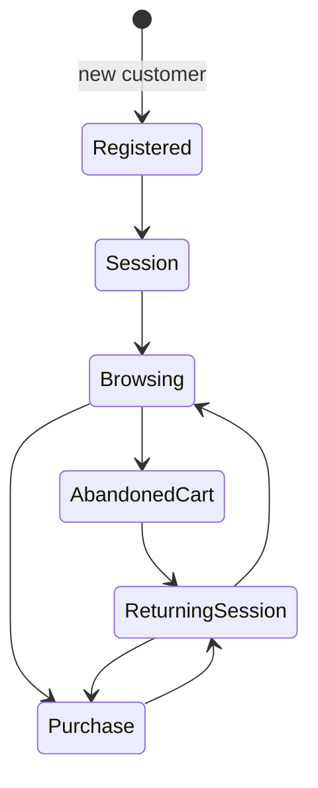
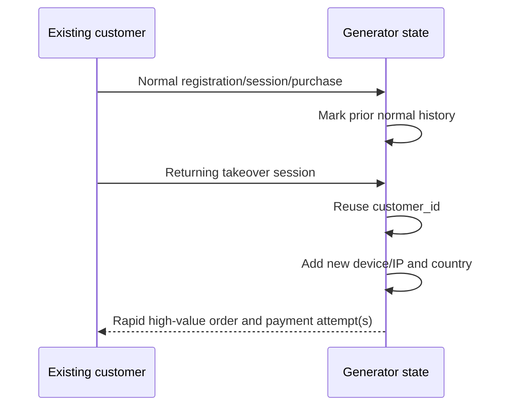
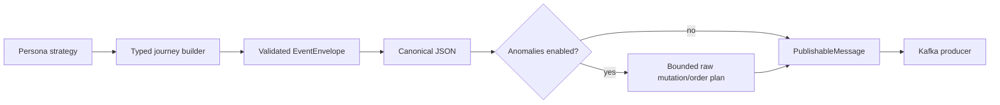

# Stateful personas and controlled anomalies

Sprint 5 makes generated data useful across journeys. Independent random
records rarely contain the history, velocity, identity changes, retries, or
ordering conditions that future streaming systems need to evaluate. The
generator now keeps a bounded process-local customer pool and applies one
registered behavior strategy per persona.

This is synthetic behavior generation, not fraud classification. No consumer,
fraud engine, DLQ processor, PostgreSQL repository, or Redis state exists yet.

## Customer state

Plain in-memory records retain customer/persona identity, registration time,
known devices and documentation-range IPs, home country, currency, prior
sessions/orders/payments, activity counters, exact `Decimal` spend, recent
products, and an optional abandoned cart. State survives only for the running
generator process. It is not Redis-backed and is intentionally lost on restart.

A journey is built against a copy and committed only after all typed events
have been constructed. Registration is emitted exactly once. Returning
journeys create a new session and preserve monotonically increasing customer
logical time.



## Persona registry

`services.event_generator.personas.registry.PERSONA_REGISTRY` is the only
`CustomerPersona -> strategy` mapping. Strategies provide bounded probability,
timing, catalogue, identity, and retry profiles; the shared journey builder
constructs every contract.

- **normal** — moderate browsing, stable device/country, high payment success,
  rare refund.
- **indecisive** — more and repeated views, long logical gaps, abandoned carts,
  revisits in later sessions, lower checkout probability.
- **discount_hunter** — prefers lower-priced products, checks out much more
  readily with a larger discount, may return to an abandoned cart.
- **suspicious** — high-value preference, rapid actions, device/country churn,
  more failures, bounded retries, and more refunds.
- **bot** — bounded catalogue-like bursts, millisecond logical gaps, stable
  automation identity, and almost no checkout.
- **account_takeover** — first establishes a successful normal purchase, then
  reuses that customer with a new device/IP, changed country, rapid high-value
  behavior, and possible payment retries.



Payment retries are separate `payment_id` values for the same `order_id`,
amount, and currency. Timestamps strictly increase. A refund can reference only
a successful payment ID. Retry count is bounded by
`GENERATOR_MAX_PAYMENT_ATTEMPTS`.

Logical event time and real pacing are independent. Personas advance injected
logical time by milliseconds, seconds, minutes, or days without sleeping.
`GENERATOR_RATE_PER_SECOND` remains the only real generation pacing control.

## Raw anomaly boundary

Anomalies are disabled by default. Valid events are always built with the
shared Pydantic contracts. The anomaly layer starts from canonical bytes and
creates invalid data only after validation. The producer accepts a typed
`PublishableMessage` and is unaware of persona or mutation rules.



Supported `synthetic_anomaly` header values:

- `duplicate`: identical event ID, body, and key are republished.
- `malformed_json`: truncated but UTF-8-safe JSON bytes.
- `missing_field`: valid JSON without a required field.
- `unknown_event_type`: valid JSON with an unregistered type.
- `payload_mismatch`: one event type with another payload shape.
- `late_event`: otherwise valid event time older than the customer watermark;
  `produced_at` remains current.
- `out_of_order`: adjacent valid messages are published in reverse order while
  retaining their timestamps.

Malformed records deliberately bypass Pydantic. Future consumers must parse
strictly, use `event_id` for idempotency, and route invalid records to the DLQ.
Synthetic duplicates differ from producer retry duplicates: they are an
intentional second application publish, while Kafka idempotence suppresses many
transport retry duplicates. Neither provides end-to-end exactly-once behavior.

## Configuration

| Variable | Default | Meaning |
| --- | --- | --- |
| `GENERATOR_CUSTOMER_POOL_SIZE` | `100` | Maximum process-local customers |
| `GENERATOR_NEW_CUSTOMER_PROBABILITY` | `0.35` | New vs returning choice |
| `GENERATOR_PERSONA_WEIGHTS` | documented six-persona mix | Normalized mix |
| `GENERATOR_STATEFUL_MODE` | `true` | Reuse process-local customers |
| `GENERATOR_MAX_PAYMENT_ATTEMPTS` | `3` | Bounded attempts per order |
| `GENERATOR_PAYMENT_RETRY_PROBABILITY` | `0.65` | Retry branch |
| `GENERATOR_ANOMALIES_ENABLED` | `false` | Raw anomaly master switch |
| `GENERATOR_*_PROBABILITY` | `0` | Individual anomaly probabilities |
| `GENERATOR_MAX_LATE_EVENT_SECONDS` | `86400` | Bounded late window |
| `GENERATOR_MAX_ANOMALIES_PER_JOURNEY` | `2` | Anomaly-type cap |

All probabilities must be from zero through one. Persona weights must name all
six personas, be non-negative, and contain at least one positive value.

## Usage

```bash
python -m services.event_generator.main --journeys 10 --persona normal --seed 42
python -m services.event_generator.main --journeys 10 --persona suspicious --seed 42
python -m services.event_generator.main --journeys 50 --persona-mix \
  "normal=0.6,indecisive=0.15,discount_hunter=0.1,suspicious=0.1,bot=0.03,account_takeover=0.02"
python -m services.event_generator.main --journeys 20 --anomalies --seed 42
```

```bash
make generator-personas
make generator-normal
make generator-suspicious
make generator-bot
make generator-takeover
make generator-anomalies
make generator-persona-smoke
make generator-anomaly-smoke
```

Explicit `--persona` overrides weights. `--persona-mix`, `--stateful`,
`--anomalies`, and `--customers` override environment defaults. A fixed seed,
injected clock, and seeded UUID factory make logical journeys and state
snapshots reproducible.

Current limitations include process-local state, a small static catalogue,
synthetic documentation-range network identities, and deliberately simple
behavior profiles. Classification, persistence, DLQ handling, and
observability are deferred.
