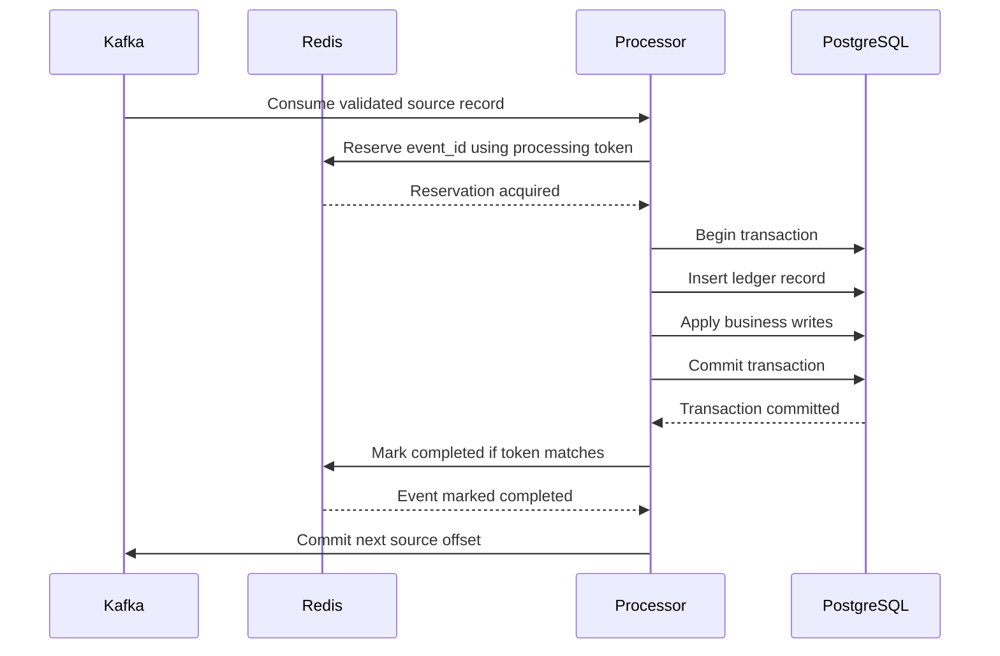
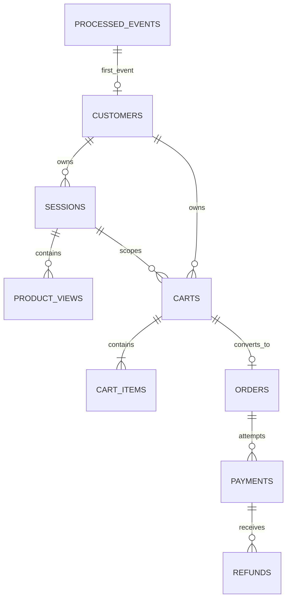
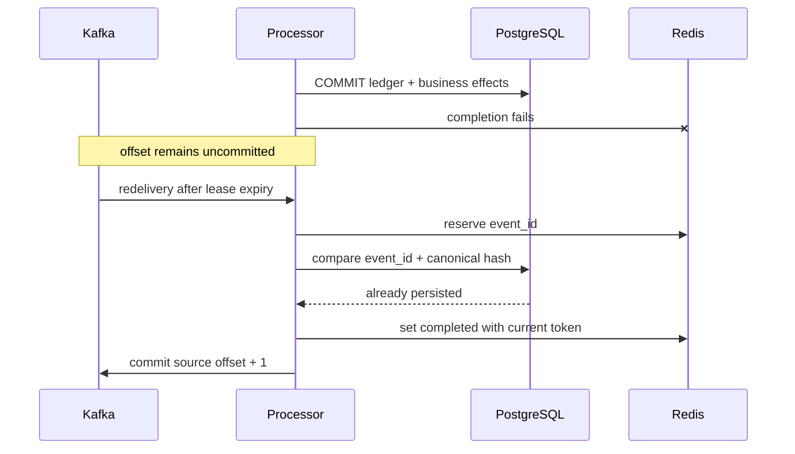
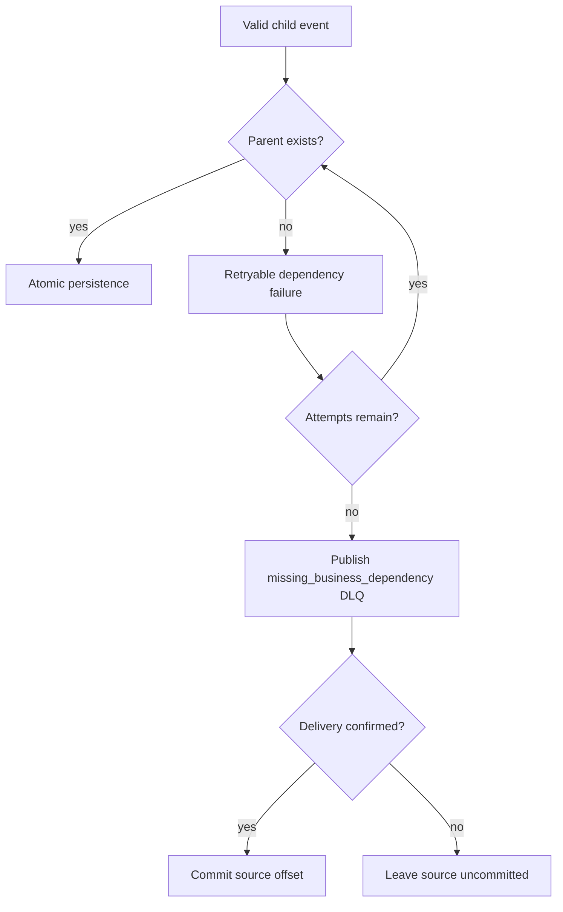

# PostgreSQL persistence

Sprint 7 makes PostgreSQL the durable system of record for every valid,
non-duplicate commerce event. The processor still consumes at least once:
PostgreSQL supplies durable idempotency, while Redis remains an expiring
operational lease and Kafka offsets remain manually managed.

## Architecture and transaction flow

`database.py` owns a bounded psycopg 3 pool and health checks.
`unit_of_work.py` acquires one connection and one explicit transaction per
source event. Typed repositories contain parameterized SQL only. The handler
registry maps every shared event type to repository operations; it never
touches Kafka or Redis.



No Kafka, Redis, or other external operation occurs inside the database
transaction. A database rollback prevents both Redis completion and source
offset commit.

## Schema and relationships

`processed_events` stores the envelope, optional canonical raw JSON, SHA-256,
Kafka source coordinate, processor identity, and processing time. Its primary
key and unique topic/partition/offset constraint independently prevent durable
duplicate effects.



The contracts do not contain complete order-item detail, so Sprint 7 does not
invent `order_items`. Product IDs are UUIDs because that is their exact shared
contract type.

## Migrations

SQL files in `database/migrations/` use ordered three-digit versions. The
runner creates `schema_migrations`, computes SHA-256 checksums, holds a
PostgreSQL advisory lock, and applies each pending migration transactionally.
An applied checksum change fails. Version 1 records the existing first-run
schema as a baseline; version 2 evolves it without dropping or recreating
application tables. `database/init/` remains first-run-only and is not
destructively rewritten.

```bash
make db-migrate
make db-migration-status
make db-schema-check
make db-tables
make db-counts
```

## Idempotency and crash recovery

The canonical complete event bytes are hashed. The same `event_id` plus the
same hash is already persisted and safe; a different hash under that ID is a
permanent integrity failure. Kafka source coordinate reuse by another event is
also permanent. Event-level tables and payment/refund event IDs have unique
keys, and mutable aggregates use deterministic upserts.



This closes the PostgreSQL-committed/Redis-failed crash window without a
distributed transaction. It is not end-to-end exactly once.

## Dependencies, retries, and DLQ

A missing customer, session, cart, order, or payment is a
`MissingBusinessDependencyError`. It receives the normal bounded retry policy.
Exhaustion is published as `missing_business_dependency`; only confirmed DLQ
delivery permits a source commit. No fake parents are created.



Future high-volume stream reordering may use retry topics or delayed
reprocessing; neither is part of Sprint 7.

## Money, payments, and refunds

Python `Decimal` values bind directly to PostgreSQL `numeric(38,18)`. Payments
must match the locked order customer, amount, and currency. Refund processing
locks the successful payment row with `SELECT ... FOR UPDATE`, sums prior
refunds, and rejects any amount beyond the exact remaining balance. This
prevents concurrent over-refunding without table locks.

## Configuration and health

`POSTGRES_DSN` and all `PROCESSOR_DB_*` settings are validated. Pool sizes and
timeouts are positive, maximum pool size covers minimum, startup attempts are
bounded, statement/connect/acquisition timeouts are explicit, and credentials
are removed from logs. Startup verifies `SELECT 1` and required schema version
2. The pool closes during graceful shutdown.

The processor Compose profile runs the one-shot `postgres-migrate` service
after PostgreSQL health succeeds. The processor then waits for successful
migration completion in addition to Kafka topic initialization and Redis
health.

## Commands and smoke tests

```bash
make persistence-sample
make persistence-smoke
make persistence-duplicate-smoke
make persistence-recovery-smoke
make persistence-dependency-smoke
make persistence-refund-smoke
```

Smoke rows use unique sources and are deleted in foreign-key-safe order.
`db-reset-test-data` requires an explicit `TEST_RUN_ID`, never truncates
tables, and never deletes migration history.

## Current limitations

Transactions are synchronous and partition ordering remains serial. There are
no retry topics, Kafka transactions, or distributed transactions. Sprint 9
adds transaction/pool metrics and PostgreSQL exporter dashboards without
moving the transaction boundary; see [Observability](observability.md). Fraud
history queries remain bounded and see only data available at processing time.

## Sprint 8 fraud transaction

Migration 003 preserves existing rows while evolving `fraud_alerts` and adding
`fraud_evaluations` and `fraud_outbox`. Every eligible source transaction now
persists its business effect and unique deterministic evaluation together.
REVIEW/BLOCK also persist the OPEN alert and canonical outbox row atomically;
rollback removes all three fraud effects. Outbox Kafka publication is a later,
independent at-least-once process and never occurs inside the source database
transaction. Published rows remain queryable.
